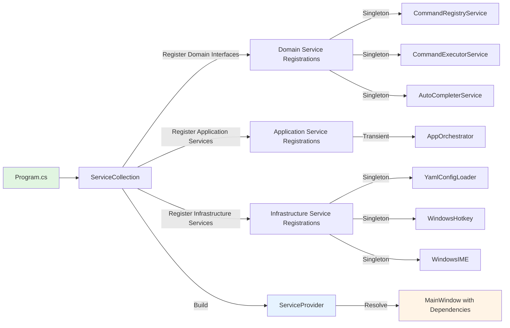

# Design Document

## Overview

This design document details the architectural transformation of TeaLauncher from a tightly-coupled legacy codebase to a modern, testable, and maintainable application following Clean Architecture principles and SOLID design patterns. The implementation will introduce dependency injection, comprehensive testing infrastructure, and automated quality verification while maintaining TeaLauncher's core performance characteristics and simplicity.

The refactoring will be incremental and non-breaking, ensuring the application continues to function during the transition. All improvements will be validated through automated tests and quality gates integrated into the development workflow.

## Steering Document Alignment

### Technical Standards (tech.md)

**Embracing Modern .NET 8 Practices:**
- Replaces legacy interface patterns (ICommandManagerInitializer, ICommandManagerFinalizer, ICommandManagerDialogShower) with comprehensive interface-based architecture
- Extends existing "Interface-based dependency injection" pattern throughout the entire codebase
- Adopts Microsoft.Extensions.DependencyInjection as the standard DI container for .NET 8

**Addressing Known Limitations:**
- **Test Coverage Limitation**: "Unit tests exist for AutoCompleteMachine and ConfigLoader only" → Comprehensive unit, integration, and e2e tests covering all layers
- **Code Quality Tooling**: Adds missing static analysis and cyclomatic complexity verification
- **Architecture Modularity**: Enforces clean boundaries between layers

**Performance Requirements (Maintained):**
- Startup time: < 500ms (DI container overhead negligible ~5-10ms)
- Hotkey response: < 100ms (unchanged by architecture refactoring)
- Memory usage: < 25MB RAM (DI container adds ~2-3MB)

### Project Structure (structure.md)

**Enhanced Organizational Pattern:**
```
TeaLauncher.Avalonia/
├── Domain/                    # Core business logic and interfaces (new layer)
│   ├── Models/               # Command, AutoCompleteResult
│   ├── Interfaces/           # ICommandRegistry, ICommandExecutor, IAutoCompleter
│   └── Exceptions/           # Domain-specific exceptions
├── Application/              # Application services (new layer)
│   ├── Services/             # Concrete service implementations
│   └── Orchestration/        # Application workflow coordination
├── Infrastructure/           # Platform and external concerns
│   ├── Configuration/        # YamlConfigLoader (existing, refactored)
│   └── Platform/             # WindowsHotkey (existing, refactored)
├── Presentation/             # UI layer
│   ├── Views/                # MainWindow (existing)
│   └── ViewModels/           # Future MVVM support
└── Program.cs               # DI container setup and app entry point
```

**Dependency Flow Enforcement:**
- Presentation → Application → Domain
- Infrastructure → Domain
- No reverse dependencies (validated by tests)

**Code Organization Principles (Reinforced):**
- Single Responsibility: CommandManager split into focused services
- Modularity: Clear boundaries between layers
- Testability: All business logic isolated from UI and platform code
- File Size Limits: Enforced through pre-commit hooks (500 lines/file, 50 lines/method)

## Code Reuse Analysis

### Existing Components to Leverage

**Configuration System:**
- **YamlConfigLoader (existing)**: Will be refactored to implement `IConfigurationLoader` interface
- **CommandConfig records (existing)**: Remain unchanged, serve as Domain models
- **Reuse Strategy**: Extract interface, add dependency injection support, preserve existing parsing logic

**Platform Abstraction:**
- **WindowsHotkey (existing)**: Will be refactored to implement `IHotkeyManager` interface
- **WindowsIMEController (existing)**: Will be refactored to implement `IIMEController` interface
- **Reuse Strategy**: Extract interfaces, make services injectable, maintain P/Invoke implementation

**Business Logic:**
- **AutoCompleteMachine (linked from CommandLauncher)**: Will be extracted to `IAutoCompleter` interface
- **CommandManager (linked from CommandLauncher)**: Will be split into three interfaces: `ICommandRegistry`, `ICommandExecutor`, `IAutoCompleter`
- **Reuse Strategy**: Gradually refactor monolithic class into focused services

**Test Infrastructure (Existing Foundation):**
- **TeaLauncher.Avalonia.Tests project**: Expand with new test categories
- **Existing directories**: Configuration/, Platform/, Integration/, EndToEnd/ (already created)
- **Reuse Strategy**: Build upon existing NUnit test project structure

### Integration Points

**Dependency Injection Integration:**
- **Entry Point**: `Program.cs` - Configure `ServiceCollection` before building Avalonia app
- **View Integration**: `MainWindow` constructor will receive injected dependencies
- **Service Registration**: All services registered in centralized `ConfigureServices` method

**Testing Integration:**
- **Unit Test Setup**: Tests will use DI container with mock implementations
- **Integration Test Setup**: Tests will use real DI container with real implementations
- **E2E Test Setup**: Tests will use Avalonia's headless testing with fully configured DI container

**Quality Gate Integration:**
- **Git Hooks**: Husky.Net pre-commit hooks trigger verification scripts
- **CI/CD**: GitHub Actions / Azure DevOps pipelines run same verification steps
- **IDE Integration**: Roslyn analyzers provide real-time feedback during development

## Architecture

### Clean Architecture Layers

```mermaid
graph TD
    subgraph "Presentation Layer"
        MainWindow[MainWindow View]
        App[App.axaml.cs]
    end

    subgraph "Application Layer"
        CommandRegistryService[CommandRegistryService]
        CommandExecutorService[CommandExecutorService]
        AutoCompleterService[AutoCompleterService]
        AppOrchestrator[ApplicationOrchestrator]
    end

    subgraph "Domain Layer"
        ICommandRegistry[ICommandRegistry]
        ICommandExecutor[ICommandExecutor]
        IAutoCompleter[IAutoCompleter]
        CommandModel[Command Model]
        Exceptions[Domain Exceptions]
    end

    subgraph "Infrastructure Layer"
        YamlConfigLoader[YamlConfigLoader: IConfigurationLoader]
        WindowsHotkey[WindowsHotkey: IHotkeyManager]
        WindowsIME[WindowsIMEController: IIMEController]
    end

    MainWindow --> AppOrchestrator
    MainWindow --> ICommandExecutor
    AppOrchestrator --> ICommandRegistry
    AppOrchestrator --> ICommandExecutor
    AppOrchestrator --> IAutoCompleter

    CommandRegistryService -.implements.-> ICommandRegistry
    CommandExecutorService -.implements.-> ICommandExecutor
    AutoCompleterService -.implements.-> IAutoCompleter

    CommandRegistryService --> CommandModel
    CommandExecutorService --> CommandModel
    AutoCompleterService --> CommandModel

    AppOrchestrator --> IConfigurationLoader
    AppOrchestrator --> IHotkeyManager

    YamlConfigLoader -.implements.-> IConfigurationLoader
    WindowsHotkey -.implements.-> IHotkeyManager
    WindowsIME -.implements.-> IIMEController

    style MainWindow fill:#e1f5e1
    style Domain Layer fill:#fff4e6
    style Application Layer fill:#e6f3ff
    style Infrastructure Layer fill:#ffe6f0
```



### Dependency Injection Architecture



### Modular Design Principles

**Single File Responsibility:**
- Each interface file contains exactly one interface definition
- Each service implementation file contains one class implementing one interface
- Configuration files separated by concern: DI setup, Husky configuration, test setup

**Component Isolation:**
- Domain layer has zero external dependencies (only .NET 8 BCL)
- Application layer depends only on Domain interfaces
- Infrastructure layer implements Domain interfaces but has no business logic
- Presentation layer orchestrates through Application services

**Service Layer Separation:**
- **Domain**: Interfaces and models only (no implementation)
- **Application**: Business logic implementations (command registry, execution, auto-completion)
- **Infrastructure**: I/O, platform-specific code, external library integration
- **Presentation**: UI event handling, view logic, user interaction

**Utility Modularity:**
- Test utilities: `TestServiceProvider` for DI in tests, `MockFactory` for creating mocks
- Verification utilities: `ComplexityAnalyzer`, `CoverageValidator`, `MetricsChecker`
- Build utilities: `BuildHelper` scripts for common build operations

## Components and Interfaces

### Domain Layer Components

#### ICommandRegistry Interface
- **Purpose:** Manages command registration and removal
- **File:** `TeaLauncher.Avalonia/Domain/Interfaces/ICommandRegistry.cs`
- **Methods:**
  ```csharp
  void RegisterCommand(Command command);
  void RemoveCommand(string commandName);
  void ClearCommands();
  bool HasCommand(string commandName);
  IReadOnlyList<Command> GetAllCommands();
  ```
- **Dependencies:** `Command` model
- **Reuses:** Extracted from existing `CommandManager.RegisterCommand()`, `RemoveCommand()`, `ClearCommands()`, `HasCommand()`

#### ICommandExecutor Interface
- **Purpose:** Executes commands with argument handling
- **File:** `TeaLauncher.Avalonia/Domain/Interfaces/ICommandExecutor.cs`
- **Methods:**
  ```csharp
  Task ExecuteAsync(string commandInput);
  string GetExecution(string commandName);
  IReadOnlyList<string> GetArguments(string commandName);
  ```
- **Dependencies:** `Command` model
- **Reuses:** Extracted from existing `CommandManager.Run()`, `GetExecution()`, `GetArguments()`

#### IAutoCompleter Interface
- **Purpose:** Provides auto-completion for command input
- **File:** `TeaLauncher.Avalonia/Domain/Interfaces/IAutoCompleter.cs`
- **Methods:**
  ```csharp
  string AutoCompleteWord(string input);
  IReadOnlyList<string> GetCandidates(string prefix);
  void UpdateWordList(IEnumerable<string> words);
  ```
- **Dependencies:** None (pure string logic)
- **Reuses:** Extracted from existing `AutoCompleteMachine` class

#### IConfigurationLoader Interface
- **Purpose:** Loads and parses configuration files
- **File:** `TeaLauncher.Avalonia/Domain/Interfaces/IConfigurationLoader.cs`
- **Methods:**
  ```csharp
  CommandsConfig LoadConfiguration(string filePath);
  Task<CommandsConfig> LoadConfigurationAsync(string filePath);
  ```
- **Dependencies:** `CommandsConfig` model
- **Reuses:** Extracted from existing `YamlConfigLoader` class

#### IHotkeyManager Interface
- **Purpose:** Manages global hotkey registration
- **File:** `TeaLauncher.Avalonia/Domain/Interfaces/IHotkeyManager.cs`
- **Methods:**
  ```csharp
  void RegisterHotkey(ModifierKeys modifiers, int keyCode, Action callback);
  void UnregisterHotkey();
  bool IsRegistered { get; }
  ```
- **Dependencies:** None
- **Reuses:** Extracted from existing `WindowsHotkey` class

#### IIMEController Interface
- **Purpose:** Controls Input Method Editor state
- **File:** `TeaLauncher.Avalonia/Domain/Interfaces/IIMEController.cs`
- **Methods:**
  ```csharp
  void DisableIME(IntPtr windowHandle);
  void EnableIME(IntPtr windowHandle);
  ```
- **Dependencies:** None
- **Reuses:** Extracted from existing `WindowsIMEController` class

#### Command Model (Existing)
- **Purpose:** Represents a registered command
- **File:** `TeaLauncher.Avalonia/Domain/Models/Command.cs` (moved from CommandManager.cs)
- **Structure:**
  ```csharp
  public record Command(string Name, string LinkTo, string? Description, string? Arguments);
  ```
- **Dependencies:** None
- **Reuses:** Extracted from existing `Command` struct in `CommandManager.cs`

### Application Layer Components

#### CommandRegistryService
- **Purpose:** Concrete implementation of ICommandRegistry
- **File:** `TeaLauncher.Avalonia/Application/Services/CommandRegistryService.cs`
- **Interfaces:** Implements `ICommandRegistry`
- **Dependencies:** `Command` model, `IAutoCompleter` (to update word list)
- **Reuses:** Logic from existing `CommandManager.RegisterCommand()`, `RemoveCommand()`, etc.
- **Lifetime:** Singleton (maintains command list state)

#### CommandExecutorService
- **Purpose:** Concrete implementation of ICommandExecutor
- **File:** `TeaLauncher.Avalonia/Application/Services/CommandExecutorService.cs`
- **Interfaces:** Implements `ICommandExecutor`
- **Dependencies:** `ICommandRegistry` (to look up commands)
- **Reuses:** Logic from existing `CommandManager.Run()`, path detection, special command handling
- **Lifetime:** Singleton (stateless execution logic)

#### AutoCompleterService
- **Purpose:** Concrete implementation of IAutoCompleter
- **File:** `TeaLauncher.Avalonia/Application/Services/AutoCompleterService.cs`
- **Interfaces:** Implements `IAutoCompleter`
- **Dependencies:** None (self-contained auto-completion logic)
- **Reuses:** Entire `AutoCompleteMachine` class logic
- **Lifetime:** Singleton (maintains word list state)

#### ApplicationOrchestrator
- **Purpose:** Coordinates application initialization and workflow
- **File:** `TeaLauncher.Avalonia/Application/Orchestration/ApplicationOrchestrator.cs`
- **Interfaces:** Custom orchestration interface
- **Dependencies:** `IConfigurationLoader`, `ICommandRegistry`, `IHotkeyManager`
- **Methods:**
  ```csharp
  Task InitializeAsync(string configPath);
  Task ReloadConfigurationAsync();
  void ShowVersionInfo();
  void ExitApplication();
  ```
- **Reuses:** Logic from existing special command handlers (!reload, !version, !exit)
- **Lifetime:** Transient (created per operation)

### Infrastructure Layer Components

#### YamlConfigLoaderService (Refactored)
- **Purpose:** YAML configuration file loading
- **File:** `TeaLauncher.Avalonia/Infrastructure/Configuration/YamlConfigLoaderService.cs`
- **Interfaces:** Implements `IConfigurationLoader`
- **Dependencies:** YamlDotNet library, `CommandsConfig` model
- **Reuses:** Existing `YamlConfigLoader` class, refactored to implement interface
- **Lifetime:** Singleton (stateless loading logic)

#### WindowsHotkeyService (Refactored)
- **Purpose:** Windows-specific global hotkey registration
- **File:** `TeaLauncher.Avalonia/Infrastructure/Platform/WindowsHotkeyService.cs`
- **Interfaces:** Implements `IHotkeyManager`
- **Dependencies:** Windows user32.dll P/Invoke
- **Reuses:** Existing `WindowsHotkey` class, refactored to implement interface
- **Lifetime:** Singleton (manages hotkey registration state)

#### WindowsIMEControllerService (Refactored)
- **Purpose:** Windows-specific IME control
- **File:** `TeaLauncher.Avalonia/Infrastructure/Platform/WindowsIMEControllerService.cs`
- **Interfaces:** Implements `IIMEController`
- **Dependencies:** Windows imm32.dll P/Invoke
- **Reuses:** Existing `WindowsIMEController` class, refactored to implement interface
- **Lifetime:** Singleton (stateless IME control)

### Presentation Layer Components

#### MainWindow (Refactored)
- **Purpose:** Primary UI window with dependency injection
- **File:** `TeaLauncher.Avalonia/Views/MainWindow.axaml.cs`
- **Current State:** Tightly coupled, creates dependencies directly
- **Refactored State:** Constructor injection of dependencies
- **Dependencies (Injected):**
  ```csharp
  public MainWindow(
      ICommandExecutor commandExecutor,
      IAutoCompleter autoCompleter,
      ApplicationOrchestrator orchestrator)
  ```
- **Reuses:** Existing UI logic, event handlers, window management
- **Changes:** Replace direct instantiation with injected dependencies

#### App (Refactored)
- **Purpose:** Application entry point with DI setup
- **File:** `TeaLauncher.Avalonia/App.axaml.cs`
- **Current State:** Minimal initialization
- **Refactored State:** Configure DI container in `OnFrameworkInitializationCompleted`
- **Responsibilities:**
  - Create `ServiceCollection`
  - Register all services
  - Build `ServiceProvider`
  - Resolve `MainWindow` with dependencies

## Data Models

### Command Model
```csharp
// File: TeaLauncher.Avalonia/Domain/Models/Command.cs
namespace TeaLauncher.Avalonia.Domain.Models;

/// <summary>
/// Represents a command that can be executed by the launcher.
/// </summary>
/// <param name="Name">The command name used for invocation</param>
/// <param name="LinkTo">The target URL, file path, or executable to launch</param>
/// <param name="Description">Optional description of the command</param>
/// <param name="Arguments">Optional default arguments for the command</param>
public record Command(
    string Name,
    string LinkTo,
    string? Description = null,
    string? Arguments = null);
```

### CommandsConfig Model (Existing)
```csharp
// File: TeaLauncher.Avalonia/Domain/Models/CommandsConfig.cs
namespace TeaLauncher.Avalonia.Domain.Models;

public record CommandsConfig
{
    [YamlMember(Alias = "commands")]
    public required List<CommandEntry> Commands { get; init; }
}

public record CommandEntry
{
    [YamlMember(Alias = "name")]
    public required string Name { get; init; }

    [YamlMember(Alias = "linkTo")]
    public required string LinkTo { get; init; }

    [YamlMember(Alias = "description")]
    public string? Description { get; init; }

    [YamlMember(Alias = "arguments")]
    public string? Arguments { get; init; }
}
```

### AutoCompleteResult Model (New)
```csharp
// File: TeaLauncher.Avalonia/Domain/Models/AutoCompleteResult.cs
namespace TeaLauncher.Avalonia.Domain.Models;

/// <summary>
/// Result of an auto-completion operation.
/// </summary>
/// <param name="CompletedText">The auto-completed text</param>
/// <param name="Candidates">List of possible completion candidates</param>
public record AutoCompleteResult(
    string CompletedText,
    IReadOnlyList<string> Candidates);
```

## Dependency Injection Configuration

### Service Registration Pattern

```csharp
// File: TeaLauncher.Avalonia/Program.cs
public static class ServiceConfiguration
{
    public static IServiceCollection ConfigureServices(this IServiceCollection services)
    {
        // Domain Services (Singleton - maintain state)
        services.AddSingleton<ICommandRegistry, CommandRegistryService>();
        services.AddSingleton<IAutoCompleter, AutoCompleterService>();
        services.AddSingleton<ICommandExecutor, CommandExecutorService>();

        // Infrastructure Services (Singleton - stateless or manage resources)
        services.AddSingleton<IConfigurationLoader, YamlConfigLoaderService>();
        services.AddSingleton<IHotkeyManager, WindowsHotkeyService>();
        services.AddSingleton<IIMEController, WindowsIMEControllerService>();

        // Application Services (Transient - per-operation)
        services.AddTransient<ApplicationOrchestrator>();

        // Presentation (Transient - created on demand)
        services.AddTransient<MainWindow>();

        return services;
    }
}
```

### App.axaml.cs Integration

```csharp
public override void OnFrameworkInitializationCompleted()
{
    // Configure dependency injection
    var services = new ServiceCollection();
    services.ConfigureServices();

    var serviceProvider = services.BuildServiceProvider();

    // Resolve MainWindow with dependencies
    var mainWindow = serviceProvider.GetRequiredService<MainWindow>();

    if (ApplicationLifetime is IClassicDesktopStyleApplicationLifetime desktop)
    {
        desktop.MainWindow = mainWindow;
    }

    base.OnFrameworkInitializationCompleted();
}
```

### Service Lifetime Rationale

**Singleton Services:**
- **CommandRegistryService**: Maintains command list state, single instance shared
- **AutoCompleterService**: Maintains word list state, single instance shared
- **CommandExecutorService**: Stateless execution logic, single instance for efficiency
- **Infrastructure Services**: Manage platform resources (hotkeys, IME), single instance required

**Transient Services:**
- **ApplicationOrchestrator**: Per-operation orchestration, no shared state
- **MainWindow**: Created once but registered as Transient for flexibility

## Pre-commit Verification System

### Husky.Net Configuration

```json
// File: .husky/task-runner.json
{
  "tasks": [
    {
      "name": "build",
      "group": "pre-commit",
      "command": "dotnet",
      "args": ["build", "--configuration", "Release"],
      "windows": null
    },
    {
      "name": "test",
      "group": "pre-commit",
      "command": "dotnet",
      "args": ["test", "--no-build", "--verbosity", "minimal"],
      "windows": null
    },
    {
      "name": "coverage",
      "group": "pre-commit",
      "command": "dotnet",
      "args": [
        "test",
        "--no-build",
        "--collect:XPlat Code Coverage",
        "--",
        "RunConfiguration.CollectSourceInformation=true"
      ],
      "windows": null
    },
    {
      "name": "metrics",
      "group": "pre-commit",
      "command": "dotnet",
      "args": ["run", "--project", "tools/MetricsChecker/MetricsChecker.csproj"],
      "windows": null
    },
    {
      "name": "format-check",
      "group": "pre-commit",
      "command": "dotnet",
      "args": ["format", "--verify-no-changes", "--verbosity", "diagnostic"],
      "windows": null
    }
  ]
}
```

### MetricsChecker Tool Design

```csharp
// File: tools/MetricsChecker/Program.cs
// Purpose: Analyze code metrics and enforce thresholds
// Technology: Roslyn code analysis APIs

public class MetricsChecker
{
    private const int MaxFileLines = 500;
    private const int MaxMethodLines = 50;
    private const int MaxCyclomaticComplexity = 15;

    public async Task<MetricsResult> AnalyzeProject(string projectPath)
    {
        // Use Roslyn to parse all C# files
        // Calculate:
        // - Lines per file
        // - Lines per method
        // - Cyclomatic complexity per method
        // Return violations
    }
}
```

### Coverage Validation

```bash
# File: .husky/pre-commit
#!/bin/sh
. "$(dirname "$0")/_/husky.sh"

# Run all pre-commit tasks
dotnet husky run --group pre-commit

# Parse coverage report and validate thresholds
dotnet tool run coverlet.console \
    TeaLauncher.Avalonia.Tests/bin/Release/net8.0-windows/TeaLauncher.Avalonia.Tests.dll \
    --target "dotnet" \
    --targetargs "test --no-build" \
    --format cobertura \
    --threshold 80 \
    --threshold-type line \
    --threshold-stat total
```

## Error Handling

### Error Scenarios

#### 1. Configuration Loading Failure
- **Scenario:** `commands.yaml` file missing, malformed, or has invalid syntax
- **Handling:**
  - `YamlConfigLoaderService.LoadConfiguration()` throws `ConfigurationException`
  - `ApplicationOrchestrator` catches exception
  - Display error dialog with file path and YAML line number
  - Fall back to empty command list (application continues without commands)
- **User Impact:** Error dialog: "Failed to load configuration from 'commands.yaml' at line 15: Invalid YAML syntax"

#### 2. Command Execution Failure
- **Scenario:** Command target doesn't exist (file not found, URL unreachable)
- **Handling:**
  - `CommandExecutorService.ExecuteAsync()` catches `Win32Exception` from `Process.Start()`
  - Log error with command name and target path
  - Display error dialog with specific failure reason
  - Window remains open for user to retry
- **User Impact:** Error dialog: "Failed to execute command 'docs': File not found at 'C:\\path\\to\\file.txt'"

#### 3. Hotkey Registration Failure
- **Scenario:** Hotkey already registered by another application
- **Handling:**
  - `WindowsHotkeyService.RegisterHotkey()` returns false
  - `ApplicationOrchestrator` detects failure during initialization
  - Display warning dialog suggesting alternative hotkey
  - Application continues without hotkey (manual activation only)
- **User Impact:** Warning dialog: "Failed to register Ctrl+Space hotkey. It may be in use by another application."

#### 4. Dependency Injection Resolution Failure
- **Scenario:** Service not registered or circular dependency
- **Handling:**
  - `ServiceProvider.GetRequiredService()` throws `InvalidOperationException`
  - Application startup fails with detailed error message
  - Error logged to console with missing service type
  - Application exits gracefully
- **User Impact:** Console error: "Failed to start application: Service 'ICommandRegistry' not registered. Please report this issue."

#### 5. Test Verification Failure (Pre-commit)
- **Scenario:** Tests fail or coverage drops below threshold
- **Handling:**
  - Husky.Net pre-commit hook returns non-zero exit code
  - Git commit blocked with detailed test failure output
  - Coverage report shows which files need more tests
  - Developer can bypass with `--no-verify` flag if necessary
- **User Impact:** Git error: "Pre-commit verification failed: 3 tests failed, coverage is 75% (threshold: 80%)"

#### 6. Code Metrics Violation (Pre-commit)
- **Scenario:** File exceeds 500 lines, method exceeds 50 lines, or complexity exceeds 15
- **Handling:**
  - `MetricsChecker` tool identifies violations
  - Pre-commit hook blocked with list of violations
  - Error message shows file, method, and metric value
  - Developer must refactor before committing
- **User Impact:** Git error: "Metrics violations found: CommandExecutorService.cs:245 - Method 'ExecuteAsync' has complexity 18 (max: 15)"

## Testing Strategy

### Unit Testing

**Framework:** NUnit 4.2.2
**Mocking:** NSubstitute (chosen for clarity and simplicity)
**Coverage Target:** ≥ 90% for Domain and Application layers

#### Test Organization
```
TeaLauncher.Avalonia.Tests/
├── Domain/
│   ├── Models/
│   │   └── CommandTests.cs
│   └── Interfaces/
│       └── (Interface contract tests if needed)
├── Application/
│   ├── Services/
│   │   ├── CommandRegistryServiceTests.cs
│   │   ├── CommandExecutorServiceTests.cs
│   │   └── AutoCompleterServiceTests.cs
│   └── Orchestration/
│       └── ApplicationOrchestratorTests.cs
├── Infrastructure/
│   ├── Configuration/
│   │   └── YamlConfigLoaderServiceTests.cs
│   └── Platform/
│       ├── WindowsHotkeyServiceTests.cs
│       └── WindowsIMEControllerServiceTests.cs
└── Utilities/
    ├── TestServiceProvider.cs
    └── MockFactory.cs
```

#### Test Patterns

**Arrange-Act-Assert (AAA):**
```csharp
[Test]
public void RegisterCommand_ShouldAddCommandToRegistry()
{
    // Arrange
    var autoCompleter = Substitute.For<IAutoCompleter>();
    var registry = new CommandRegistryService(autoCompleter);
    var command = new Command("test", "https://example.com");

    // Act
    registry.RegisterCommand(command);

    // Assert
    Assert.That(registry.HasCommand("test"), Is.True);
}
```

**Mock Setup Example:**
```csharp
[Test]
public async Task ExecuteAsync_ShouldLookupCommand_FromRegistry()
{
    // Arrange
    var mockRegistry = Substitute.For<ICommandRegistry>();
    var testCommand = new Command("docs", "https://docs.example.com");
    mockRegistry.GetAllCommands().Returns(new[] { testCommand });

    var executor = new CommandExecutorService(mockRegistry);

    // Act
    await executor.ExecuteAsync("docs");

    // Assert
    mockRegistry.Received(1).GetAllCommands();
}
```

#### Key Components to Test

**CommandRegistryService:**
- Command registration (add, remove, clear)
- Duplicate command handling
- Case-insensitive command lookup
- Auto-completer word list synchronization

**CommandExecutorService:**
- Command execution with arguments
- Path detection (URLs, file paths)
- Special command handling (!reload, !version, !exit)
- Error handling for missing commands

**AutoCompleterService:**
- Prefix-based auto-completion
- Candidate list generation
- Word list updates
- Empty input handling

**ApplicationOrchestrator:**
- Configuration loading on initialization
- Configuration reload workflow
- Hotkey registration coordination
- Special command delegation

### Integration Testing

**Framework:** NUnit 4.2.2
**Approach:** Real DI container with real implementations
**Coverage Target:** ≥ 80% for critical integration paths

#### Test Organization
```
TeaLauncher.Avalonia.Tests/Integration/
├── CommandWorkflowTests.cs
├── ConfigurationIntegrationTests.cs
├── HotkeyIntegrationTests.cs
└── Fixtures/
    ├── test-commands.yaml
    └── invalid-commands.yaml
```

#### Key Flows to Test

**Configuration → Registration → Execution:**
```csharp
[Test]
public async Task LoadConfig_RegisterCommands_ExecuteCommand_ShouldSucceed()
{
    // Arrange: Real DI container with real services
    var services = new ServiceCollection();
    services.ConfigureServices();
    var provider = services.BuildServiceProvider();

    var configLoader = provider.GetRequiredService<IConfigurationLoader>();
    var registry = provider.GetRequiredService<ICommandRegistry>();
    var executor = provider.GetRequiredService<ICommandExecutor>();

    // Act: Load config, register commands, execute
    var config = await configLoader.LoadConfigurationAsync("Fixtures/test-commands.yaml");
    foreach (var cmd in config.Commands)
    {
        registry.RegisterCommand(new Command(cmd.Name, cmd.LinkTo));
    }

    // Assert: Verify end-to-end flow
    Assert.That(registry.HasCommand("test-cmd"), Is.True);
    Assert.DoesNotThrowAsync(() => executor.ExecuteAsync("test-cmd"));
}
```

**YAML Parsing → Service Initialization:**
- Load valid YAML → Commands registered → Auto-completer updated
- Load invalid YAML → Exception thrown with line number
- Load missing file → Exception with file path

**Hotkey Registration → Command Execution:**
- Register hotkey → Trigger callback → Execute command (mocked on Linux)
- Register conflicting hotkey → Handle failure gracefully

### End-to-End Testing

**Framework:** NUnit 4.2.2 + Avalonia Headless Testing
**Approach:** Full application lifecycle simulation
**Coverage Target:** Critical user workflows covered

#### Test Organization
```
TeaLauncher.Avalonia.Tests/EndToEnd/
├── ApplicationLifecycleTests.cs
├── UserWorkflowTests.cs
├── SpecialCommandsTests.cs
└── Fixtures/
    └── e2e-test-config.yaml
```

#### User Scenarios to Test

**Complete Launch Workflow:**
```csharp
[Test]
public async Task CompleteWorkflow_LaunchApp_ExecuteCommand_Exit()
{
    // Arrange: Configure headless Avalonia app
    using var app = AvaloniaApp.BuildAvaloniaApp()
        .UseHeadless()
        .StartWithMainWindow<MainWindow>();

    // Act: Simulate user interaction
    var window = app.MainWindow as MainWindow;
    window.InputTextBox.Text = "test-cmd";
    window.SimulateKeyPress(Key.Enter);

    await Task.Delay(100); // Wait for execution

    // Assert: Verify command was executed
    Assert.That(window.IsVisible, Is.False); // Window hidden after execution
}
```

**Configuration Reload Workflow:**
- Application starts → Load config → Execute !reload → Verify new commands

**Auto-completion Workflow:**
- Application starts → Type partial command → Press Tab → Verify completion

**Special Commands Workflow:**
- Execute !version → Verify version dialog displayed
- Execute !exit → Verify application exits gracefully

#### Cross-Platform Testing Notes

**Linux Development Environment:**
- Use headless Avalonia testing (no display server required)
- Mock Windows-specific components (IHotkeyManager, IIMEController)
- Verify Windows targeting still works through conditional compilation

## Implementation Roadmap

### Phase 1: Foundation (Tasks 1-4)
1. Create Domain layer structure and interfaces
2. Create Application layer structure
3. Set up dependency injection in Program.cs
4. Extract interfaces from existing services

### Phase 2: Service Refactoring (Tasks 5-8)
5. Refactor CommandManager into three services
6. Refactor YamlConfigLoader to implement interface
7. Refactor WindowsHotkey to implement interface
8. Create ApplicationOrchestrator

### Phase 3: Testing Infrastructure (Tasks 9-12)
9. Set up unit test structure with NSubstitute
10. Create test utilities (TestServiceProvider, MockFactory)
11. Write unit tests for all services (≥ 90% coverage)
12. Write integration tests for critical flows

### Phase 4: Quality Gates (Tasks 13-16)
13. Install and configure Husky.Net
14. Create MetricsChecker tool
15. Configure pre-commit hooks
16. Set up CI/CD quality gates

### Phase 5: Advanced Testing (Tasks 17-18)
17. Create end-to-end tests with Avalonia headless
18. Create TESTING.md documentation

### Phase 6: Validation (Tasks 19-20)
19. Run full test suite and verify coverage thresholds
20. Test pre-commit hooks and quality gates in real workflow

## Technology Choices Rationale

### Dependency Injection: Microsoft.Extensions.DependencyInjection
- **Why:** Official .NET DI container, lightweight, well-documented
- **Alternatives Considered:** Autofac (too heavyweight), DryIoc (less standard)
- **Trade-offs:** Less feature-rich than Autofac, but simpler and more idiomatic

### Mocking Framework: NSubstitute
- **Why:** Clean syntax, readable test code, 25% developer preference
- **Alternatives Considered:** Moq (70% preference but more verbose), FakeItEasy
- **Trade-offs:** Less popular than Moq, but better readability for this project

### Pre-commit Hooks: Husky.Net
- **Why:** Native .NET tool, C# scripting support, task runner
- **Alternatives Considered:** Python pre-commit framework (requires Python), Git hooks directly (harder to manage)
- **Trade-offs:** Requires .NET tool installation, but integrates seamlessly

### Code Metrics: Roslyn APIs
- **Why:** Built into .NET SDK, no external dependencies, accurate C# analysis
- **Alternatives Considered:** SonarQube (too heavyweight for pre-commit), CodeMetrics.exe (deprecated)
- **Trade-offs:** Requires custom tool development, but fully customizable

### Coverage: Coverlet (XPlat Code Coverage)
- **Why:** Cross-platform, integrated with dotnet test, Cobertura format
- **Alternatives Considered:** dotCover (Windows-only), OpenCover (outdated)
- **Trade-offs:** Limited to line/branch coverage, but sufficient for requirements
