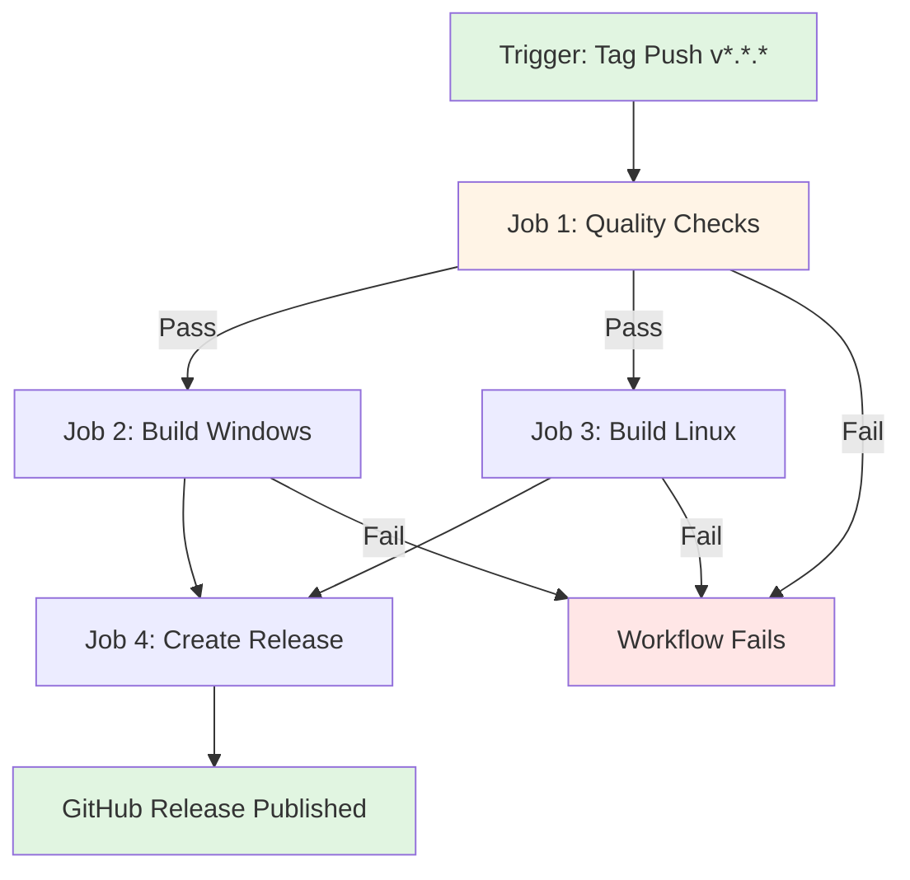

# Design Document

## Overview

This design document outlines the technical implementation of an automated release pipeline using GitHub Actions to build and distribute TeaLauncher binaries for Windows and Linux platforms. The workflow triggers on version tags (e.g., `v1.0.0`), runs quality validation, builds platform-specific single-file executables, and publishes them as GitHub Releases with auto-generated release notes.

The solution follows GitHub Actions best practices for multi-platform builds, artifact management, and release creation. It integrates seamlessly with the existing CI/CD infrastructure (ci.yml, pr-validation.yml) while introducing a new release-specific workflow.

## Steering Document Alignment

### Technical Standards (tech.md)

**Build System Alignment:**
- Uses dotnet publish for Release configuration builds
- Leverages existing PublishSingleFile and SelfContained project configuration
- Maintains .NET 8 as the target framework
- Follows existing quality gate validation (tests, coverage, metrics, formatting)

**Quality Standards:**
- Reuses existing quality check patterns from ci.yml
- Enforces pre-release quality validation (all gates must pass)
- Maintains 60% coverage threshold, zero metrics violations, zero format violations
- Runs full test suite (305+ tests) before building binaries

**Cross-Platform Support:**
- Aligns with future vision: "Cross-Platform Support: .NET Core port for Linux and macOS compatibility"
- Uses runtime identifiers (RIDs): win-x64, linux-x64
- Single workflow builds all platforms using ubuntu-latest runner

### Project Structure (structure.md)

**GitHub Actions Organization:**
- New workflow file: `.github/workflows/release.yml`
- Follows existing naming convention (lowercase, hyphenated)
- Mirrors job structure from ci.yml (quality checks, build steps)
- Artifacts stored in GitHub Releases (not repository)

**Version Management:**
- Extracts version from git tags (v1.0.0 → 1.0.0)
- Pre-release detection via tag suffixes (-alpha, -beta, -rc)
- Release naming: "TeaLauncher v{version}"

## Code Reuse Analysis

### Existing Components to Leverage

**CI/CD Infrastructure:**
- **ci.yml workflow**: Reuse quality check job structure (restore, build, test, coverage, metrics, format)
  - Located: `.github/workflows/ci.yml`
  - Reuse: Checkout, .NET setup, NuGet caching, quality gate steps

- **Project Configuration**: Already configured for single-file publishing
  - Located: `TeaLauncher.Avalonia/TeaLauncher.Avalonia.csproj`
  - Settings: `PublishSingleFile=true`, `SelfContained=true`, `IncludeNativeLibrariesForSelfExtract=true`
  - Reuse: No changes needed to project file

**Quality Tools:**
- **scripts/check-coverage.sh**: Coverage threshold validation
- **tools/MetricsChecker**: Code metrics validation
- **dotnet format**: Code formatting validation
- **Husky.Net**: Pre-commit hooks (not used in CI, only local)

**GitHub Actions Actions:**
- `actions/checkout@v4`: Repository checkout
- `actions/setup-dotnet@v4`: .NET SDK installation
- `actions/cache@v4`: NuGet package caching
- `actions/upload-artifact@v4`: Artifact management (existing CI usage)
- `softprops/action-gh-release@v1`: GitHub Release creation (new)

### Integration Points

**Workflow Triggers:**
- New trigger: `on.push.tags` with pattern `v*.*.*`
- Separate from existing CI triggers (push to master, pull requests)
- No conflicts with existing workflows

**Build Artifacts:**
- Published to GitHub Releases (not uploaded as workflow artifacts)
- Asset naming: `TeaLauncher-{version}-{platform}.{ext}`
- Storage: Permanent (GitHub Releases, not 30-day artifact retention)

## Architecture

### Workflow Structure

The release workflow consists of 4 sequential jobs with clear dependencies:



**Job Execution Strategy:**
- Job 1 (Quality Checks): Sequential prerequisite
- Jobs 2-3 (Platform Builds): Parallel execution after Job 1 passes
- Job 4 (Release Creation): Waits for all builds to complete

**Runner Selection:**
- All jobs use `ubuntu-latest` runner (Linux-based GitHub-hosted runner)
- Windows builds use cross-compilation (`-r win-x64`)
- Linux builds use native compilation (`-r linux-x64`)

### Modular Design Principles

**Job Responsibilities:**
1. **quality-checks**: Validates code meets all quality gates (single responsibility)
2. **build-windows**: Produces Windows x64 executable (platform-specific)
3. **build-linux**: Produces Linux x64 executable (platform-specific)
4. **create-release**: Publishes GitHub Release with all artifacts (release management)

**Reusable Steps:**
- Checkout + Setup .NET + Cache: Common pattern across all jobs
- Quality validation: Extracted from ci.yml, reusable
- Build script: Parameterized by runtime identifier (RID)

**Error Isolation:**
- Each job fails independently
- Workflow fails if any job fails (fail-fast: false for parallel builds)
- Clear error attribution (job level, not step level)

## Components and Interfaces

### Component 1: Workflow Trigger Configuration
- **Purpose**: Define when the release workflow executes
- **Configuration**:
  ```yaml
  on:
    push:
      tags:
        - 'v*.*.*'
  ```
- **Behavior**:
  - Triggers on tags matching semantic versioning: `v1.0.0`, `v2.3.1-beta`, `v0.1.0-rc1`
  - Does NOT trigger on: branch pushes, pull requests, non-version tags
- **Interfaces**: GitHub webhook → GitHub Actions runner
- **Dependencies**: Git tag creation by maintainer
- **Reuses**: Standard GitHub Actions trigger syntax

### Component 2: Quality Checks Job
- **Purpose**: Validate code quality before building release binaries
- **Steps**:
  1. Checkout repository
  2. Setup .NET 8.0.x SDK
  3. Cache NuGet packages (~/.nuget/packages)
  4. Restore dependencies
  5. Build in Release configuration
  6. Run all 305+ tests
  7. Collect code coverage
  8. Validate coverage ≥60% (scripts/check-coverage.sh)
  9. Validate code metrics (tools/MetricsChecker)
  10. Validate code formatting (dotnet format --verify-no-changes)
- **Interfaces**:
  - Input: Source code from tagged commit
  - Output: Pass/Fail status (blocks subsequent jobs if failed)
- **Dependencies**: .NET SDK, NuGet, quality tools (all from existing CI)
- **Reuses**: Exact steps from ci.yml (lines 18-84)

### Component 3: Build Windows Job
- **Purpose**: Create self-contained Windows x64 executable
- **Steps**:
  1. Checkout repository
  2. Setup .NET 8.0.x SDK
  3. Extract version from tag (`${{ github.ref_name }}` → `v1.0.0` → `1.0.0`)
  4. Publish executable:
     ```bash
     dotnet publish TeaLauncher.Avalonia/TeaLauncher.Avalonia.csproj \
       -c Release \
       -r win-x64 \
       --self-contained true \
       -p:PublishSingleFile=true \
       -p:IncludeNativeLibrariesForSelfExtract=true \
       -p:AssemblyVersion=${{ env.VERSION }} \
       -p:FileVersion=${{ env.VERSION }} \
       -o ./publish/windows
     ```
  5. Rename output: `TeaLauncher.Avalonia.exe` → `TeaLauncher-{version}-win-x64.exe`
  6. Upload artifact for release job
- **Interfaces**:
  - Input: Source code, version from tag
  - Output: Single-file .exe uploaded to workflow artifacts
- **Dependencies**: .NET SDK, win-x64 runtime libraries (cross-compilation)
- **Reuses**: Project PublishSingleFile configuration

### Component 4: Build Linux Job
- **Purpose**: Create self-contained Linux x64 executable
- **Steps**:
  1. Checkout repository
  2. Setup .NET 8.0.x SDK
  3. Extract version from tag
  4. Publish executable:
     ```bash
     dotnet publish TeaLauncher.Avalonia/TeaLauncher.Avalonia.csproj \
       -c Release \
       -r linux-x64 \
       --self-contained true \
       -p:PublishSingleFile=true \
       -p:IncludeNativeLibrariesForSelfExtract=true \
       -p:AssemblyVersion=${{ env.VERSION }} \
       -p:FileVersion=${{ env.VERSION }} \
       -o ./publish/linux
     ```
  5. Rename output: `TeaLauncher.Avalonia` → `TeaLauncher-{version}-linux-x64`
  6. Set execute permissions: `chmod +x TeaLauncher-{version}-linux-x64`
  7. Upload artifact for release job
- **Interfaces**:
  - Input: Source code, version from tag
  - Output: Single-file executable (no extension) uploaded to workflow artifacts
- **Dependencies**: .NET SDK, linux-x64 runtime libraries
- **Reuses**: Project PublishSingleFile configuration

### Component 5: Create Release Job
- **Purpose**: Publish GitHub Release with platform binaries and release notes
- **Steps**:
  1. Checkout repository (for release notes generation)
  2. Download Windows artifact
  3. Download Linux artifact
  4. Generate release notes from commit history since previous tag
  5. Create GitHub Release using softprops/action-gh-release@v1:
     ```yaml
     - name: Create GitHub Release
       uses: softprops/action-gh-release@v1
       with:
         tag_name: ${{ github.ref_name }}
         name: TeaLauncher ${{ github.ref_name }}
         body: |
           ## Downloads
           - **Windows**: [TeaLauncher-{version}-win-x64.exe]
           - **Linux**: [TeaLauncher-{version}-linux-x64]

           ## Installation
           **Windows**: Download the .exe file and run directly
           **Linux**: Download, make executable (`chmod +x`), and run

           ## Changes
           ${{ steps.changelog.outputs.changelog }}
         files: |
           ./TeaLauncher-*-win-x64.exe
           ./TeaLauncher-*-linux-x64
         prerelease: ${{ contains(github.ref_name, '-alpha') || contains(github.ref_name, '-beta') || contains(github.ref_name, '-rc') }}
         token: ${{ secrets.GITHUB_TOKEN }}
     ```
- **Interfaces**:
  - Input: Workflow artifacts (Windows + Linux binaries), git commit history
  - Output: Published GitHub Release with assets
- **Dependencies**: softprops/action-gh-release action, GITHUB_TOKEN (built-in)
- **Reuses**: Git tagging convention (v*.*.*), semantic versioning

## Data Models

### Version Information
```
Input: Git tag name (string)
  Format: "v{major}.{minor}.{patch}[-{prerelease}]"
  Examples: "v1.0.0", "v2.3.1-beta", "v0.5.0-rc1"

Extracted: Semantic version (string)
  Format: "{major}.{minor}.{patch}[-{prerelease}]"
  Examples: "1.0.0", "2.3.1-beta", "0.5.0-rc1"
  Usage: Assembly versioning, asset naming
```

### Build Artifact
```
Windows Artifact:
  Name: TeaLauncher-{version}-win-x64.exe
  Size: ~40-50 MB (includes .NET 8 runtime + Avalonia libraries)
  Format: PE32+ executable (Windows)
  Permissions: Not applicable (Windows executable)

Linux Artifact:
  Name: TeaLauncher-{version}-linux-x64
  Size: ~50-60 MB (includes .NET 8 runtime + Avalonia libraries)
  Format: ELF 64-bit LSB executable (Linux)
  Permissions: rwxr-xr-x (755)
```

### GitHub Release
```
Release:
  tag_name: v{version} (e.g., "v1.0.0")
  name: "TeaLauncher v{version}"
  body: Markdown-formatted release notes (downloads + installation + changelog)
  draft: false (published immediately)
  prerelease: true if tag contains -alpha/-beta/-rc, false otherwise
  assets: [Windows .exe, Linux executable]
```

### Workflow Artifacts (Intermediate)
```
Artifact: build-windows
  Path: TeaLauncher-{version}-win-x64.exe
  Retention: 1 day (ephemeral, only for passing to release job)

Artifact: build-linux
  Path: TeaLauncher-{version}-linux-x64
  Retention: 1 day (ephemeral, only for passing to release job)
```

## Error Handling

### Error Scenarios

1. **Scenario: Quality Checks Fail**
   - **Handling**: Job 1 exits with non-zero code, jobs 2-4 are skipped
   - **User Impact**: No release created, workflow run shows red X, maintainer sees which quality gate failed (tests, coverage, metrics, format)
   - **Recovery**: Fix code issues, delete and re-push tag

2. **Scenario: Windows Build Fails**
   - **Handling**: Job 2 fails, job 4 waits indefinitely (needs: [build-windows, build-linux])
   - **User Impact**: Workflow times out after 6 hours (GitHub default), no release created
   - **Mitigation**: Add explicit timeout (timeout-minutes: 15) to build jobs, fail fast if one build fails

3. **Scenario: Linux Build Fails**
   - **Handling**: Job 3 fails, job 4 waits indefinitely
   - **User Impact**: Same as Windows build failure
   - **Mitigation**: Same timeout strategy

4. **Scenario: Both Builds Succeed but Release Creation Fails**
   - **Handling**: Job 4 fails, GitHub Release is not created but binaries exist as workflow artifacts
   - **User Impact**: Maintainer can manually download artifacts from workflow run and create release
   - **Recovery**: Fix release job configuration, re-run workflow via GitHub UI

5. **Scenario: Tag Already Has a Release**
   - **Handling**: softprops/action-gh-release updates existing release instead of creating new one
   - **User Impact**: Release assets are replaced with new binaries, release notes updated
   - **Benefit**: Idempotent workflow (safe to re-run)

6. **Scenario: NuGet Package Restore Fails**
   - **Handling**: Restore step fails, workflow exits before quality checks
   - **User Impact**: No release created, error message: "Failed to restore NuGet packages"
   - **Mitigation**: Cache NuGet packages, retry on transient network errors (GitHub Actions automatic retry)

7. **Scenario: .NET SDK Installation Fails**
   - **Handling**: Setup .NET step fails, workflow cannot proceed
   - **User Impact**: No release created, error in workflow logs
   - **Recovery**: GitHub Actions team resolves runner issues, re-run workflow

8. **Scenario: Invalid Tag Format (e.g., "release-1.0")**
   - **Handling**: Workflow does not trigger (tag pattern v*.*.* not matched)
   - **User Impact**: No workflow run, no error message
   - **Prevention**: Document tag naming convention in CONTRIBUTING.md

## Testing Strategy

### Unit Testing

**Not Applicable**: GitHub Actions workflows cannot be unit tested in the traditional sense.

**Alternative Validation**:
- YAML syntax validation: Use `actionlint` or GitHub's workflow validator
- Dry-run testing: Manually trigger workflow with test tags on a fork

### Integration Testing

**Approach**: Test workflow on non-production tags in real GitHub environment

**Test Scenarios**:
1. **Happy Path - Stable Release**:
   - Create tag: `v0.0.1-test`
   - Expected: All jobs pass, GitHub Release created with 2 assets, pre-release=false

2. **Pre-release Tag**:
   - Create tag: `v0.0.2-beta-test`
   - Expected: Release marked as pre-release

3. **Quality Check Failure**:
   - Intentionally break a test, create tag: `v0.0.3-fail-test`
   - Expected: quality-checks job fails, no release created

4. **Re-push Same Tag**:
   - Delete tag `v0.0.1-test`, re-push
   - Expected: Existing release updated with new assets

**Test Environment**:
- Use fork of repository for testing (avoid polluting main repo releases)
- Test tags should have `-test` suffix to distinguish from real releases

### End-to-End Testing

**Approach**: Validate complete workflow from tag creation to binary execution

**User Scenarios**:
1. **Windows User Downloads and Runs**:
   - Workflow completes → Navigate to Releases → Download Windows .exe → Execute
   - Expected: Application launches successfully, shows version from tag

2. **Linux User Downloads and Runs**:
   - Workflow completes → Download Linux executable → `chmod +x` → Execute
   - Expected: Application launches successfully (on Linux with X11/Wayland)

3. **Maintainer Creates Release**:
   - Fix bug → Commit → Push to master → Tag with `v1.0.1` → Push tag
   - Expected: Within 10 minutes, GitHub Release published with binaries

**Validation Checklist**:
- [ ] Workflow triggers on v*.*.* tags only
- [ ] Quality checks run and pass
- [ ] Windows build produces ~40-50MB .exe
- [ ] Linux build produces ~50-60MB executable with +x permissions
- [ ] GitHub Release created with tag name
- [ ] Release notes include changelog
- [ ] Both binaries downloadable from release page
- [ ] Windows binary runs on Windows 10/11
- [ ] Linux binary runs on Ubuntu 22.04+ with GUI

### Performance Testing

**Approach**: Measure workflow execution time across multiple runs

**Metrics**:
- Quality checks job: Target <3 minutes
- Build jobs (parallel): Target <5 minutes each
- Create release job: Target <1 minute
- Total workflow time: Target 5-7 minutes (max 10 minutes)

**Measurement**:
- GitHub Actions built-in timing for each job
- Compare against baseline from ci.yml (quality checks ~3-4 minutes)

**Optimization Strategies**:
- NuGet package caching (reduces restore from 60s → 10s)
- Parallel platform builds (halves build time vs. sequential)
- Skip redundant steps (no need to run tests twice for each platform)

## Implementation Plan

### Phase 1: Workflow Creation
1. Create `.github/workflows/release.yml` file
2. Define trigger configuration (on.push.tags)
3. Copy quality-checks job from ci.yml
4. Add build-windows job with dotnet publish
5. Add build-linux job with dotnet publish
6. Add create-release job with softprops/action-gh-release

**Validation**: YAML syntax validates, workflow appears in GitHub Actions tab

### Phase 2: Testing with Test Tags
1. Create test tag: `v0.0.1-test`
2. Push tag, observe workflow execution
3. Verify all jobs pass
4. Download artifacts, test executables locally
5. Delete test release

**Validation**: Workflow completes successfully, binaries execute correctly

### Phase 3: Documentation
1. Add release instructions to README.md
2. Document tag naming convention in CONTRIBUTING.md (if exists)
3. Update TESTING.md with release workflow validation steps
4. Add workflow badge to README.md

**Validation**: Documentation is clear and accurate

### Phase 4: Production Release
1. Merge workflow to master branch
2. Create first production tag: `v2.0.0` (matches AssemblyVersion in .csproj)
3. Push tag, monitor workflow
4. Verify GitHub Release published correctly
5. Test download and execution on Windows and Linux

**Validation**: Production release successful, binaries publicly available
