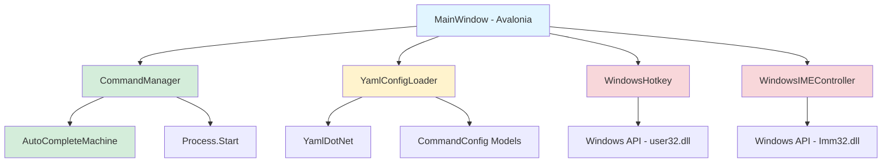

# Design Document

## Overview

This design specifies the complete migration of TeaLauncher from Windows Forms (.NET Framework 3.5) to Avalonia UI (.NET 8) with YAML configuration support. The migration is Windows-only, optimized for cross-compilation from Linux, and eliminates unnecessary cross-platform abstractions.

**Key Design Principles:**
- **Windows-First**: Direct Windows API usage without abstraction layers
- **Modern Stack**: Avalonia 11.x + .NET 8 + YamlDotNet
- **Code Reuse**: Preserve 60%+ of existing business logic
- **Performance**: Sub-100ms hotkey response, <300ms startup

## Steering Document Alignment

### Technical Standards (tech.md)

**Language & Runtime:**
- Migrating from C# .NET Framework 3.5 to C# .NET 8
- Maintaining C# coding conventions (PascalCase, m_ prefix for private fields)
- Leveraging modern C# features: nullable reference types, pattern matching, records

**Architecture Patterns:**
- Preserving interface-based dependency injection (ICommandManagerInitializer, ICommandManagerFinalizer, ICommandManagerDialogShower)
- Maintaining delegate-based event callbacks
- Replacing exception-driven validation with modern validation patterns where appropriate

**Testing:**
- Reusing existing unit test patterns for business logic (AutoCompleteMachine, CommandManager)
- Adding Avalonia UI tests for window behavior

### Project Structure (structure.md)

**Directory Organization:**
```
TeaLauncher.Avalonia/
├── TeaLauncher.Avalonia.csproj
├── App.axaml / App.axaml.cs          # Application entry
├── Views/
│   ├── MainWindow.axaml              # Main window XAML
│   └── MainWindow.axaml.cs           # Code-behind
├── Platform/
│   ├── WindowsHotkey.cs              # Global hotkey (Windows API)
│   └── WindowsIMEController.cs       # IME control (Windows API)
├── Configuration/
│   ├── CommandConfig.cs              # Configuration models
│   └── YamlConfigLoader.cs           # YAML parsing
└── Core/                              # Linked from CommandLauncher/
    ├── CommandManager.cs              # Reused - command execution
    └── AutoCompleteMachine.cs         # Reused - auto-completion
```

**Naming Conventions:**
- Maintain existing conventions: PascalCase for classes, m_ prefix for private fields
- Avalonia-specific: `.axaml` for XAML files, `.axaml.cs` for code-behind
- New files follow existing patterns

## Code Reuse Analysis

### Existing Components to Leverage

**✅ Direct Reuse (No Changes):**
- **AutoCompleteMachine.cs**: Pure logic for prefix matching and auto-completion
  - Methods: `RegisterWord()`, `RemoveWord()`, `AutoCompleteWord()`, `GetCandidates()`
  - No dependencies on Windows Forms or .NET Framework-specific APIs

- **CommandManager.cs**: Command registry and execution engine
  - Methods: `RegisterCommand()`, `Run()`, `HasCommand()`, `ClearCommands()`
  - Already uses `Process.Start()` which is cross-.NET compatible
  - Interface contracts remain valid

**🔄 Adaptation Required:**
- **ConfigLoader.cs** → **YamlConfigLoader.cs**: Replace custom INI parser with YamlDotNet
  - Keep interface concept (load, parse, validate)
  - Modernize to use strongly-typed models instead of Dictionary<string, Dictionary<string, string>>

**❌ Complete Rewrite:**
- **Form1.cs / Form1.Designer.cs**: Windows Forms UI → Avalonia XAML
  - Functionality preserved, implementation changed
  - Event handlers adapted to Avalonia patterns

- **Hotkey.cs**: Windows Forms message loop → Direct Windows API integration
  - P/Invoke remains, but hookup to Avalonia window handle

- **IMEController.cs**: Inherits from Form → Standalone Windows API wrapper
  - Remove Form inheritance, keep P/Invoke logic

### Integration Points

**CommandManager Integration:**
- MainWindow implements existing interfaces: ICommandManagerInitializer, ICommandManagerFinalizer, ICommandManagerDialogShower
- No changes to CommandManager code required
- AutoCompleteMachine integration via inheritance remains unchanged

**Configuration Integration:**
- YamlConfigLoader returns Command objects (existing structure)
- CommandManager.RegisterCommand() accepts same Command structure
- Seamless drop-in replacement for ConfigLoader

**Process Execution:**
- Process.Start with UseShellExecute=true works identically in .NET 8
- No changes needed to execution logic

## Architecture

### Component Diagram



**Legend:**
- Blue: Avalonia UI Layer
- Green: Reused Business Logic
- Yellow: New Configuration Layer
- Red: Windows-Specific Platform Layer

### Layer Architecture

**1. Presentation Layer (Avalonia UI)**
- **MainWindow.axaml**: XAML declarative UI
  - AutoCompleteBox for command input
  - Blur background effect
  - Topmost, borderless window
- **MainWindow.axaml.cs**: Event handling and orchestration
  - Keyboard event routing (Tab, Enter, Escape)
  - Window show/hide logic
  - Interface implementations (ICommandManagerInitializer, etc.)

**2. Business Logic Layer (Reused)**
- **CommandManager**: Command registry and execution
  - Manages List<Command> of registered commands
  - Executes commands via Process.Start
  - Handles special commands (!reload, !exit, !version)
- **AutoCompleteMachine**: Auto-completion engine
  - Prefix matching algorithm
  - Candidate suggestion

**3. Configuration Layer (New)**
- **YamlConfigLoader**: YAML parsing with YamlDotNet
  - Deserializes commands.yaml to CommandConfig objects
  - Validates required fields (name, linkto)
  - Provides clear error messages
- **CommandConfig Models**: Strongly-typed configuration
  - Record types for commands
  - Validation attributes

**4. Platform Layer (Windows-Specific)**
- **WindowsHotkey**: Global hotkey registration
  - P/Invoke to RegisterHotKey/UnregisterHotKey
  - Window message hook for WM_HOTKEY
  - ID range search (0x0000-0xBFFF)
- **WindowsIMEController**: IME state control
  - P/Invoke to Imm32.dll functions
  - IME on/off toggle sequence

## Components and Interfaces

### Component 1: MainWindow (Avalonia)

**Purpose:** Primary user interface - command input window with hotkey activation

**Interfaces:**
```csharp
public partial class MainWindow : Window,
    ICommandManagerInitializer,
    ICommandManagerFinalizer,
    ICommandManagerDialogShower
{
    // ICommandManagerInitializer
    void Reinitialize();

    // ICommandManagerFinalizer
    void Exit();

    // ICommandManagerDialogShower
    void ShowVersionInfo();
    void ShowError(string message);
}
```

**Dependencies:**
- Avalonia.Controls.Window (base class)
- CommandManager (business logic)
- YamlConfigLoader (configuration)
- WindowsHotkey (platform service)
- WindowsIMEController (platform service)

**Reuses:** Existing interface contracts from Windows Forms version

**Key Methods:**
- `ShowWindow()`: Display launcher, focus input, reset IME
- `HideWindow()`: Hide launcher, clear input
- `OnHotkeyPressed()`: Handle global hotkey event
- `CompleteCommand()`: Tab-completion logic
- `RunCommand()`: Execute command via CommandManager

### Component 2: WindowsHotkey

**Purpose:** Register and handle global system hotkey (Ctrl+Space)

**Interfaces:**
```csharp
public class WindowsHotkey : IDisposable
{
    public event EventHandler? HotKeyPressed;

    public WindowsHotkey(Window window, ModifierKeys modifiers, Key key);
    public void Dispose();
}
```

**P/Invoke:**
```csharp
[DllImport("user32.dll")]
private static extern int RegisterHotKey(IntPtr hWnd, int id, uint fsModifiers, uint vk);

[DllImport("user32.dll")]
private static extern int UnregisterHotKey(IntPtr hWnd, int id);
```

**Dependencies:**
- Avalonia Window (for HWND handle via TryGetPlatformHandle())
- Windows user32.dll

**Implementation Strategy:**
1. Get native HWND from Avalonia window: `window.TryGetPlatformHandle()?.Handle`
2. Register hotkey with ID search (0x0000-0xBFFF range)
3. Hook window messages using Avalonia's platform-specific message handling
4. Raise HotKeyPressed event when WM_HOTKEY (0x0312) received
5. Unregister on Dispose()

### Component 3: WindowsIMEController

**Purpose:** Control Windows Input Method Editor state for Japanese input

**Interfaces:**
```csharp
public class WindowsIMEController : IDisposable
{
    public WindowsIMEController(IntPtr windowHandle);

    public void On();
    public void Off();
    public void Dispose();
}
```

**P/Invoke:**
```csharp
[DllImport("Imm32.dll")]
private static extern IntPtr ImmGetContext(IntPtr hWnd);

[DllImport("Imm32.dll")]
private static extern int ImmReleaseContext(IntPtr hWnd, IntPtr hIMC);

[DllImport("Imm32.dll")]
private static extern int ImmSetOpenStatus(IntPtr hIMC, int fOpen);
```

**Dependencies:**
- Windows Imm32.dll
- Window HWND handle

**Reuses:** Existing P/Invoke signatures from IMEController.cs, removes Form inheritance

### Component 4: YamlConfigLoader

**Purpose:** Load and parse YAML configuration files into strongly-typed objects

**Interfaces:**
```csharp
public class YamlConfigLoader
{
    public CommandsConfig LoadConfigFile(string filePath);
    public void ValidateConfig(CommandsConfig config);
}

public record CommandsConfig
{
    public List<CommandEntry> Commands { get; init; } = new();
}

public record CommandEntry
{
    [YamlMember(Alias = "name")]
    public required string Name { get; init; }

    [YamlMember(Alias = "linkto")]
    public required string LinkTo { get; init; }

    [YamlMember(Alias = "description")]
    public string? Description { get; init; }
}
```

**Dependencies:**
- YamlDotNet library (NuGet package)

**Reuses:** ConfigLoader interface concept, modernized with records and YamlDotNet

**Error Handling:**
```csharp
// YamlException: Syntax errors with line/column info
// ValidationException: Missing required fields
// FileNotFoundException: Missing configuration file
```

### Component 5: CommandManager (Reused)

**Purpose:** Command registry and execution engine

**Public Methods:**
```csharp
public void RegisterCommand(Command command);
public void RemoveCommand(string command);
public void Run(string command);
public bool HasCommand(string command);
public void ClearCommands();
public List<string> GetCandidates(string chars);
public string AutoCompleteWord(string chars);
```

**Dependencies:**
- AutoCompleteMachine (inherited)
- ICommandManagerInitializer, ICommandManagerFinalizer, ICommandManagerDialogShower (interfaces)

**Reuses:** Entire implementation unchanged from existing codebase

### Component 6: AutoCompleteMachine (Reused)

**Purpose:** Prefix-matching auto-completion engine

**Public Methods:**
```csharp
public void RegisterWord(string word);
public void RemoveWord(string word);
public void ClearWords();
public string AutoCompleteWord(string chars);
public List<string> GetCandidates(string chars);
public bool HasItem(string item);
```

**Dependencies:** None (pure logic)

**Reuses:** Entire implementation unchanged from existing codebase

## Data Models

### CommandsConfig (YAML Root)

```csharp
public record CommandsConfig
{
    [YamlMember(Alias = "commands")]
    public List<CommandEntry> Commands { get; init; } = new();
}
```

**Example YAML:**
```yaml
commands:
  - name: google
    linkto: https://google.com
    description: Google search engine

  - name: notepad
    linkto: C:\Windows\System32\notepad.exe
    description: Text editor
```

### CommandEntry (Individual Command)

```csharp
public record CommandEntry
{
    [YamlMember(Alias = "name")]
    [Required]
    public required string Name { get; init; }

    [YamlMember(Alias = "linkto")]
    [Required]
    public required string LinkTo { get; init; }

    [YamlMember(Alias = "description")]
    public string? Description { get; init; }

    [YamlMember(Alias = "arguments")]
    public string? Arguments { get; init; }
}
```

**Field Descriptions:**
- `name`: Command keyword (e.g., "google", "notepad")
- `linkto`: URL, file path, or executable path
- `description`: Optional human-readable description
- `arguments`: Optional default arguments to pass

### Command (Existing Business Logic Model)

```csharp
class Command
{
    public string command;      // Command name
    public string execution;    // Full execution string with arguments
}
```

**Mapping from YAML to Command:**
```csharp
var cmd = new Command
{
    command = entry.Name,
    execution = string.IsNullOrEmpty(entry.Arguments)
        ? entry.LinkTo
        : $"{entry.LinkTo} {entry.Arguments}"
};
```

## Error Handling

### Error Scenarios

**1. Configuration File Missing**
- **Handling:** Catch FileNotFoundException in YamlConfigLoader.LoadConfigFile()
- **User Impact:** Display error dialog: "Configuration file not found: {filePath}. Please create commands.yaml in the application directory."

**2. Invalid YAML Syntax**
- **Handling:** Catch YamlException from YamlDotNet
- **User Impact:** Display error dialog with line/column: "YAML syntax error at line {line}, column {column}: {message}"

**3. Missing Required Fields**
- **Handling:** Required properties throw exception during deserialization
- **User Impact:** Display validation error: "Configuration error: Command at index {i} is missing required field '{fieldName}'"

**4. Hotkey Registration Failure**
- **Handling:** RegisterHotKey returns 0, try incrementing ID (0x0000-0xBFFF)
- **User Impact:** If all IDs exhausted, display warning: "Failed to register global hotkey. Another application may be using Ctrl+Space. You can still activate the launcher manually."

**5. Command Execution Failure**
- **Handling:** Catch exceptions from Process.Start()
- **User Impact:** Display error dialog: "Failed to execute command '{command}': {exception.Message}"

**6. IME Control Failure**
- **Handling:** Catch exceptions from Imm32 API calls, continue operation
- **User Impact:** Silent failure - IME state not changed, but launcher still functions

## Testing Strategy

### Unit Testing

**Components to Test:**
- **AutoCompleteMachine**: Already has tests (Test_AutoCompleteMachine.cs)
  - Reuse existing test cases
  - Verify prefix matching works correctly

- **CommandManager**: Partially tested
  - Test command registration
  - Test special commands (!reload, !exit, !version)
  - Mock Process.Start for execution tests

- **YamlConfigLoader**: New tests required
  - Test valid YAML parsing
  - Test invalid syntax handling
  - Test missing required fields
  - Test default value handling

**Test Framework:** NUnit (maintain consistency with existing tests)

**Example Test:**
```csharp
[Test]
public void YamlConfigLoader_ValidYaml_DeserializesCorrectly()
{
    // Arrange
    var yaml = @"
commands:
  - name: test
    linkto: https://test.com
";
    File.WriteAllText("test.yaml", yaml);
    var loader = new YamlConfigLoader();

    // Act
    var config = loader.LoadConfigFile("test.yaml");

    // Assert
    Assert.AreEqual(1, config.Commands.Count);
    Assert.AreEqual("test", config.Commands[0].Name);
    Assert.AreEqual("https://test.com", config.Commands[0].LinkTo);
}
```

### Integration Testing

**Test Scenarios:**
1. **End-to-End Command Execution**
   - Load configuration from YAML
   - Register commands
   - Execute command
   - Verify process launched

2. **Configuration Reload**
   - Load initial configuration
   - Execute !reload command
   - Verify new commands available

3. **Auto-Completion Flow**
   - Type partial command
   - Press Tab
   - Verify completion matches expected value

**Test Approach:**
- Use in-memory YAML strings
- Mock Process.Start where possible
- Verify state changes in CommandManager

### End-to-End Testing

**Manual Test Plan:**

1. **Hotkey Activation** (Windows only)
   - Press Ctrl+Space from desktop
   - Verify window appears and is focused
   - Press Ctrl+Space again
   - Verify window hides

2. **Command Execution**
   - Open launcher
   - Type "google"
   - Press Enter
   - Verify browser opens to google.com

3. **Auto-Completion**
   - Open launcher
   - Type "goo"
   - Press Tab
   - Verify completes to "google"

4. **Configuration Reload**
   - Edit commands.yaml
   - Add new command
   - Execute !reload in launcher
   - Verify new command available

5. **Error Handling**
   - Delete commands.yaml
   - Start application
   - Verify error dialog displays

**Automated E2E Testing:**
- Use Avalonia.Headless for UI testing
- Test window show/hide behavior
- Test keyboard event handling
- Cannot automate global hotkey (requires Windows focus)

## Build Configuration

### Cross-Compilation Setup

**Project File (.csproj):**
```xml
<Project Sdk="Microsoft.NET.Sdk">
  <PropertyGroup>
    <OutputType>WinExe</OutputType>
    <TargetFramework>net8.0-windows</TargetFramework>
    <RuntimeIdentifier>win-x64</RuntimeIdentifier>
    <SelfContained>true</SelfContained>
    <PublishSingleFile>true</PublishSingleFile>
    <Nullable>enable</Nullable>
    <TreatWarningsAsErrors>true</TreatWarningsAsErrors>
  </PropertyGroup>

  <!-- Avalonia packages -->
  <ItemGroup>
    <PackageReference Include="Avalonia" Version="11.2.2" />
    <PackageReference Include="Avalonia.Desktop" Version="11.2.2" />
    <PackageReference Include="Avalonia.Themes.Fluent" Version="11.2.2" />
    <PackageReference Include="Avalonia.Fonts.Inter" Version="11.2.2" />
  </ItemGroup>

  <!-- YAML parsing -->
  <ItemGroup>
    <PackageReference Include="YamlDotNet" Version="16.3.0" />
  </ItemGroup>

  <!-- Link existing business logic -->
  <ItemGroup>
    <Compile Include="..\CommandLauncher\CommandManager.cs" Link="Core\CommandManager.cs" />
    <Compile Include="..\CommandLauncher\AutoCompleteMachine.cs" Link="Core\AutoCompleteMachine.cs" />
  </ItemGroup>
</Project>
```

**Build Commands:**
```bash
# Development build (from Linux)
dotnet build -c Debug

# Release build for Windows
dotnet publish -c Release -r win-x64 --self-contained true -p:PublishSingleFile=true

# Output: TeaLauncher.Avalonia.exe (single-file executable)
```

**Dependencies:**
- .NET 8 SDK (on Linux build machine)
- Windows SDK not required (cross-compilation supported)

## Deployment

**Distribution Package:**
```
TeaLauncher-win-x64-v2.0.0/
├── TeaLauncher.exe          # Single-file executable
├── commands.yaml            # Example configuration
└── README.md                # Setup instructions
```

**Installation:**
1. Extract to desired directory
2. Edit commands.yaml with your commands
3. Run TeaLauncher.exe
4. Press Ctrl+Space to activate

**No Installation Required:**
- Self-contained .NET runtime included
- No external dependencies
- Portable - runs from any directory
