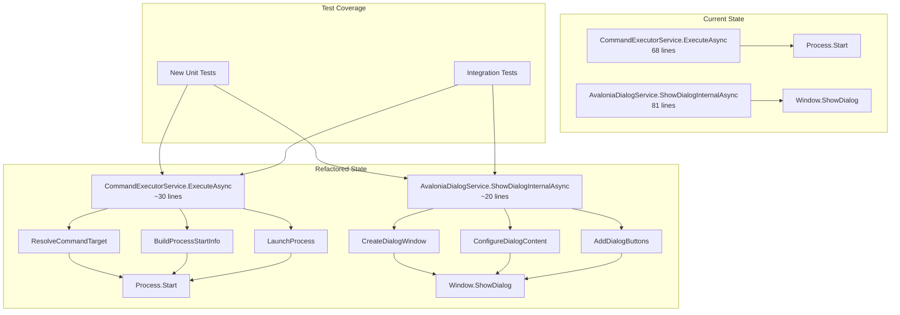

# Design Document

## Overview

This design document outlines the technical approach to achieve pre-commit compliance by addressing three critical quality gates: code coverage (61%→80%), code metrics (2 method violations), and code formatting (28 whitespace violations). The solution follows a three-pronged approach:

1. **Coverage Enhancement**: Add targeted unit tests for uncovered code paths in core services
2. **Method Refactoring**: Extract helper methods from `CommandExecutorService.ExecuteAsync` and `AvaloniaDialogService.ShowDialogInternalAsync` to reduce complexity
3. **Format Correction**: Apply `dotnet format` to resolve whitespace violations in legacy test files

This feature integrates with the existing Husky.Net pre-commit hook infrastructure, ensuring all quality gates are validated automatically before commits enter the repository.

## Steering Document Alignment

### Technical Standards (tech.md)

**Testing Framework Alignment:**
- Uses NUnit 3.13.3 (current test framework)
- Follows NSubstitute mocking patterns (established in existing tests)
- Leverages FluentAssertions for expressive test assertions
- Maintains test isolation using dependency injection

**Performance Requirements:**
- New tests must not exceed 20% increase in test suite execution time
- Refactored methods maintain original performance characteristics
- Coverage collection completes within 5 seconds

**Code Quality Tools:**
- Integrates with existing Husky.Net pre-commit hooks
- Uses coverlet for XPlat code coverage measurement
- Applies custom MetricsChecker tool for code metrics validation
- Uses dotnet format for consistent code formatting

### Project Structure (structure.md)

**Test Organization:**
- Unit tests mirror source structure: `Application/Services/FooService.cs` → `Application/Services/FooServiceTests.cs`
- Integration tests placed in `Integration/` directory
- Test fixtures stored in appropriate `Fixtures/` subdirectories
- Follows namespace convention: `TeaLauncher.Avalonia.Tests.{Layer}.{Component}`

**Naming Conventions:**
- Test classes: `{ClassName}Tests.cs` (e.g., `CommandExecutorServiceTests.cs`)
- Test methods: `MethodName_Scenario_ExpectedBehavior` pattern
- Helper methods in refactored code: `PascalCase` following C# conventions
- Private fields: `_camelCase` prefix (modern C# convention, not legacy `m_` prefix)

## Code Reuse Analysis

### Existing Components to Leverage

**Test Infrastructure:**
- **PerformanceTestBase**: Provides timing utilities (`TimeOperation`, `TimeOperationAsync`) and assertion methods (`AssertDuration`)
  - Located: `TeaLauncher.Avalonia.Tests/Performance/PerformanceTestBase.cs`
  - Reuse for: Performance regression testing of refactored methods

- **NSubstitute Mocking**: Already used extensively in service tests
  - Pattern: `Substitute.For<IInterface>()` to create mocks
  - Example: `CommandExecutorServiceTests.cs` lines 41-48
  - Reuse for: All new service unit tests

- **FluentAssertions**: Current assertion library
  - Pattern: `result.Should().BeTrue()`, `act.Should().Throw<Exception>()`
  - Reuse for: All new test assertions

**Quality Tools:**
- **coverlet.collector**: XPlat code coverage collection (already in test project)
- **scripts/check-coverage.sh**: Coverage threshold validation script
- **tools/MetricsChecker**: Custom Roslyn analyzer for code metrics
- **Husky.Net**: Pre-commit hook orchestration (`.husky/task-runner.json`)

**Service Patterns:**
- **Dependency Injection**: All services use constructor injection with interface dependencies
  - Pattern: `public FooService(IBar bar)` with null checking
  - Reuse for: Any extracted helper classes if needed

### Integration Points

**Existing Test Structure:**
- New unit tests integrate into `Application/Services/` test directory
- Coverage reports integrate with existing `coverage/` directory structure
- Husky hooks already configured to run coverage checks (`.husky/task-runner.json`)

**Configuration Files:**
- **.editorconfig**: Defines formatting rules for `dotnet format`
- **.husky/task-runner.json**: Pre-commit hook task definitions
- **TeaLauncher.Avalonia.Tests.csproj**: Already includes coverlet.collector package

## Architecture

### Modular Design Principles

This feature follows the established three-layer architecture of TeaLauncher.Avalonia:

1. **Domain Layer**: No changes (interfaces and models remain stable)
2. **Application Layer**: Refactor existing services to extract helper methods
3. **Infrastructure Layer**: No changes (platform-specific code unaffected)
4. **Test Layer**: Add new tests mirroring application layer structure

**Refactoring Strategy:**
- **Extract Method Pattern**: Long methods split into focused helper methods
- **Single Responsibility**: Each extracted method handles one logical step
- **Preserve Public API**: Public method signatures remain unchanged
- **Maintain Testability**: Extracted private methods tested through public API



## Components and Interfaces

### Component 1: CommandExecutorService Refactoring
- **Purpose**: Split 68-line `ExecuteAsync` method into focused helper methods
- **Current Issues**:
  - Method handles command resolution, argument parsing, special command detection, and process launching
  - Exceeds 50-line limit (68 lines at CommandExecutorService.cs:49)
- **Refactoring Plan**:
  ```csharp
  // Public API (unchanged)
  public async Task ExecuteAsync(string commandInput)

  // New private helper methods (each ≤50 lines)
  private (string filename, string args) ResolveCommandTarget(string commandInput)
  private ProcessStartInfo BuildProcessStartInfo(string filename, string args)
  private void LaunchProcess(ProcessStartInfo startInfo)
  ```
- **Extracted Responsibilities**:
  - **ResolveCommandTarget**: Determines execution target (direct path vs. registry lookup) and combines arguments
  - **BuildProcessStartInfo**: Creates ProcessStartInfo with appropriate shell execution settings
  - **LaunchProcess**: Executes process and handles exceptions
- **Interfaces**: No changes to `ICommandExecutor` interface
- **Dependencies**: `ICommandRegistry` (existing)
- **Reuses**: Existing helper methods (`IsPath`, `GetExecution`, `GetArguments`, `IsSpecialCommand`)

### Component 2: AvaloniaDialogService Refactoring
- **Purpose**: Split 81-line `ShowDialogInternalAsync` method into UI composition methods
- **Current Issues**:
  - Method handles window creation, content layout, styling, button creation, and event handling
  - Exceeds 50-line limit (81 lines at AvaloniaDialogService.cs:110)
- **Refactoring Plan**:
  ```csharp
  // Public API (unchanged)
  private async Task<bool> ShowDialogInternalAsync(Window owner, string title, string message, DialogType dialogType)

  // New private helper methods (each ≤50 lines)
  private Window CreateDialogWindow(string title)
  private StackPanel ConfigureDialogContent(string message, DialogType dialogType)
  private StackPanel CreateDialogButtons(DialogType dialogType, Window dialog, ref bool result)
  ```
- **Extracted Responsibilities**:
  - **CreateDialogWindow**: Creates base Window with size, position, and properties
  - **ConfigureDialogContent**: Builds message TextBlock with styling based on DialogType
  - **CreateDialogButtons**: Creates Yes/No or OK buttons based on DialogType with event handlers
- **Interfaces**: No changes to `IDialogService` interface (if exists)
- **Dependencies**: Avalonia.Controls (existing)
- **Reuses**: Existing `DialogType` enum

### Component 3: Coverage Enhancement Tests
- **Purpose**: Add unit tests targeting uncovered code paths to achieve ≥80% coverage
- **Target Areas** (based on 61% current coverage):
  - Edge cases in `CommandExecutorService`: special command handling, registry lookup failures
  - Error paths in `AutoCompleterService`: empty input, no candidates
  - Configuration edge cases in `YamlConfigLoaderService`: malformed YAML, missing files
  - Dialog service variations: different `DialogType` values
- **Test Structure**:
  ```csharp
  [TestFixture]
  public class {ServiceName}Tests
  {
      [SetUp]
      public void SetUp() { /* Initialize mocks */ }

      [Test]
      public void MethodName_Scenario_ExpectedBehavior() { /* Test implementation */ }
  }
  ```
- **Interfaces**: Uses existing NUnit, NSubstitute, FluentAssertions APIs
- **Dependencies**:
  - NUnit 3.13.3 (test framework)
  - NSubstitute 5.1.0 (mocking)
  - FluentAssertions 6.12.0 (assertions)
- **Reuses**:
  - Existing test fixtures and mock setup patterns
  - `PerformanceTestBase` for any performance-sensitive tests

### Component 4: Format Correction
- **Purpose**: Apply dotnet format to fix 28 whitespace violations in legacy test files
- **Target Files**:
  - `TestCommandLauncher/Test_AutoCompleteMachine.cs` (13 violations)
  - `TestCommandLauncher/Test_ConfigLoader.cs` (15 violations)
- **Approach**:
  - Run `dotnet format` with .editorconfig rules
  - Verify tests still pass after formatting (4 tests in TestCommandLauncher project)
- **Interfaces**: Command-line tool (no code changes)
- **Dependencies**: dotnet format CLI tool
- **Reuses**: Existing .editorconfig formatting rules

## Data Models

### PerformanceResult (Existing - Reused)
```csharp
public record PerformanceResult(
    string OperationName,
    TimeSpan Duration,
    int MaxAllowedMs,
    bool Passed)
{
    public double DurationMs => Duration.TotalMilliseconds;
    public double PercentageOfLimit => (DurationMs / MaxAllowedMs) * 100;
}
```

### CoverageReport (Conceptual - Not Implemented)
```
XML structure from coverage.cobertura.xml:
- line-rate: decimal (0.61 → ≥0.80 target)
- packages: collection of package elements
  - package/classes/class: source file coverage
    - lines-covered: int
    - lines-valid: int
```

### No new data models required
All refactoring maintains existing domain models (`Command`, `CommandConfig`, etc.). Tests use existing models and interfaces.

## Error Handling

### Error Scenarios

1. **Scenario: Refactored Method Breaks Existing Tests**
   - **Handling**: Run full test suite after each refactoring step; rollback if any test fails
   - **User Impact**: No impact (caught during development, not committed)
   - **Prevention**: Use IDE refactoring tools; maintain test-driven approach

2. **Scenario: Coverage Collection Fails**
   - **Handling**: Script checks for coverage.cobertura.xml existence; fails pre-commit with clear message
   - **User Impact**: Developer sees error: "Coverage report not found at ./coverage/**/coverage.cobertura.xml"
   - **Mitigation**: Documented in TESTING.md with troubleshooting steps

3. **Scenario: Format Changes Alter Test Behavior**
   - **Handling**: Run `dotnet test` immediately after `dotnet format`; verify 267 tests pass
   - **User Impact**: No impact (validation in development)
   - **Prevention**: Whitespace-only formatting cannot change logic; validation ensures safety

4. **Scenario: New Tests Fail Intermittently (Flaky Tests)**
   - **Handling**: Run new tests 10 times consecutively; require 100% pass rate
   - **User Impact**: No impact (caught during test development)
   - **Prevention**: Avoid time-based assertions; use deterministic mocks; no external dependencies

5. **Scenario: Coverage Threshold Not Met After Adding Tests**
   - **Handling**: check-coverage.sh script fails with current coverage percentage and gap
   - **User Impact**: Developer sees: "Coverage 75% is below threshold 80%" with actionable steps
   - **Mitigation**: Iteratively add tests until threshold met; coverage report identifies uncovered lines

6. **Scenario: Metrics Checker Still Reports Violations After Refactoring**
   - **Handling**: MetricsChecker fails pre-commit with specific file:line violations
   - **User Impact**: Developer sees: "Method 'Foo' has 55 lines (max: 50)" with file path
   - **Mitigation**: Further refactor extracted methods if they still exceed limits

7. **Scenario: Extracted Methods Introduce Performance Regression**
   - **Handling**: Performance tests using `PerformanceTestBase` catch regressions
   - **User Impact**: Test fails with timing data: "ExecuteAsync took 150ms but should complete within 100ms"
   - **Mitigation**: Profile refactored code; optimize if needed; extracted methods should have zero overhead

## Testing Strategy

### Unit Testing

**Approach**: AAA pattern (Arrange-Act-Assert) with mocked dependencies

**Key Components to Test**:
1. **CommandExecutorService** (increase coverage):
   - Special command detection (`!reload`, `!version`, `!exit`)
   - Registry lookup edge cases (command not found, null results)
   - Argument combination scenarios (command args + input args)
   - Path vs. registry command routing
   - ProcessStartInfo configuration variations

2. **AvaloniaDialogService** (increase coverage):
   - Each `DialogType` variation (Message, Error, Confirm)
   - Button click handlers (Yes/No/OK)
   - Error styling application
   - Window property configuration

3. **AutoCompleterService** (fill gaps):
   - Empty input handling
   - No candidates scenario
   - Special character handling in prefixes

4. **YamlConfigLoaderService** (edge cases):
   - Malformed YAML parsing
   - Missing file handling
   - Empty configuration files
   - Invalid command structure validation

**Test Pattern Example**:
```csharp
[Test]
public async Task ExecuteAsync_WithSpecialCommand_ShouldThrowNotSupportedException()
{
    // Arrange
    var service = new CommandExecutorService(_mockCommandRegistry);

    // Act
    Func<Task> act = async () => await service.ExecuteAsync("!reload");

    // Assert
    await act.Should().ThrowAsync<NotSupportedException>()
        .WithMessage("*Special commands*must be handled by ApplicationOrchestrator*");
}
```

**Coverage Target**:
- Overall: 61% → ≥80% (+19% increase)
- Critical services: 90%+ (CommandExecutor, CommandRegistry, AutoCompleter)
- Infrastructure: 70%+ (ConfigLoader, UI services)
- Focus on line coverage (as measured by coverlet)

### Integration Testing

**Approach**: Test interactions between real components with minimal mocking

**Key Flows to Test**:
1. **Configuration Loading to Command Execution**:
   - Load YAML config → Register commands → Execute command → Verify process launched
   - Uses real `YamlConfigLoaderService` + real `CommandRegistryService` + mocked `Process.Start`

2. **Auto-completion Workflow**:
   - Register commands → Request completions → Verify candidate list
   - Uses real `CommandRegistryService` + real `AutoCompleterService`

3. **Error Propagation**:
   - Invalid config → Load service throws → Orchestrator catches → Dialog shown
   - Uses real services with intentionally invalid input

**Test Pattern Example**:
```csharp
[Test]
public async Task CommandWorkflow_FromConfigToExecution_ShouldSucceed()
{
    // Arrange: Integration test using real services
    var configService = new YamlConfigLoaderService();
    var registryService = new CommandRegistryService();
    var executorService = new CommandExecutorService(registryService);

    var config = await configService.LoadAsync("Integration/Fixtures/test-commands.yaml");
    await registryService.RegisterCommandsAsync(config.Commands);

    // Act & Assert: Verify end-to-end workflow
    Func<Task> act = async () => await executorService.ExecuteAsync("google");
    await act.Should().NotThrowAsync();
}
```

**Existing Integration Tests**:
- Located in `TeaLauncher.Avalonia.Tests/Integration/`
- Use test fixtures in `Integration/Fixtures/*.yaml`
- Follow existing patterns in `CommandWorkflowTests.cs` and `ConfigurationIntegrationTests.cs`

### End-to-End Testing

**Approach**: Headless Avalonia UI testing with full application lifecycle

**User Scenarios to Test**:
1. **Refactored Command Execution**:
   - User launches app → Presses hotkey → Types command → Presses Enter → Process launches
   - Validates refactored `CommandExecutorService.ExecuteAsync` works in real UI context

2. **Refactored Dialog Display**:
   - User triggers error scenario → Dialog appears → User clicks button → Dialog closes
   - Validates refactored `AvaloniaDialogService.ShowDialogInternalAsync` UI is correct

3. **Special Command Handling** (existing E2E coverage):
   - Already tested in `EndToEnd/SpecialCommandsTests.cs`
   - Verify no regression after refactoring

**Test Infrastructure**:
- Uses `Avalonia.Headless` for UI testing without display
- Uses `Avalonia.Headless.NUnit` for test integration
- Existing E2E tests in `TeaLauncher.Avalonia.Tests/EndToEnd/`

**Validation**:
- All 267 existing tests must pass after refactoring
- E2E tests confirm UI behavior unchanged
- Performance tests confirm no degradation

### Performance Testing

**Approach**: Use `PerformanceTestBase` to measure refactored methods

**Key Metrics**:
- `CommandExecutorService.ExecuteAsync`: Must complete within 100ms (existing requirement)
- `AvaloniaDialogService.ShowDialogInternalAsync`: Must complete within 200ms (UI rendering)
- Auto-completion: Must complete within 50ms (existing requirement)

**Test Example**:
```csharp
[Test]
public async Task RefactoredExecuteAsync_ShouldMeetPerformanceRequirement()
{
    // Arrange
    var result = await TimeOperationAsync(
        "Refactored ExecuteAsync",
        async () => await _service.ExecuteAsync("test-command"),
        maxAllowedMs: 100);

    // Assert
    AssertDuration(result);
}
```

## Implementation Plan

### Phase 1: Code Formatting (Quick Win)
1. Run `dotnet format` on solution
2. Verify all tests pass (267 tests)
3. Commit formatting changes independently

**Validation**: `dotnet format --verify-no-changes` returns 0 violations

### Phase 2: Method Refactoring
1. Refactor `CommandExecutorService.ExecuteAsync`:
   - Extract `ResolveCommandTarget` helper
   - Extract `BuildProcessStartInfo` helper
   - Extract `LaunchProcess` helper
   - Run unit tests after each extraction

2. Refactor `AvaloniaDialogService.ShowDialogInternalAsync`:
   - Extract `CreateDialogWindow` helper
   - Extract `ConfigureDialogContent` helper
   - Extract `CreateDialogButtons` helper
   - Run unit and E2E tests after each extraction

**Validation**:
- MetricsChecker reports 0 method length violations
- All 267 existing tests pass
- Performance tests show no regression

### Phase 3: Coverage Enhancement
1. Analyze coverage report: `coverage/**/coverage.cobertura.xml`
2. Identify uncovered lines per service (prioritize by criticality)
3. Write unit tests for uncovered code paths:
   - Start with `CommandExecutorService` edge cases
   - Continue with `AutoCompleterService` scenarios
   - Add `YamlConfigLoaderService` error path tests
   - Fill `AvaloniaDialogService` coverage gaps
4. Run coverage check after each new test file
5. Iterate until ≥80% threshold achieved

**Validation**:
- `scripts/check-coverage.sh` passes
- All new tests pass 10 consecutive runs (0% flakiness)
- Total test execution time within 850ms (<20% increase from 700ms)

### Phase 4: Pre-Commit Integration
1. Verify Husky hooks execute all checks
2. Test commit workflow with intentional violations
3. Confirm blocking behavior works correctly
4. Document workflow in TESTING.md updates

**Validation**:
- `dotnet husky run` passes all tasks
- `git commit` triggers hooks automatically
- Failing checks block commits with clear errors
