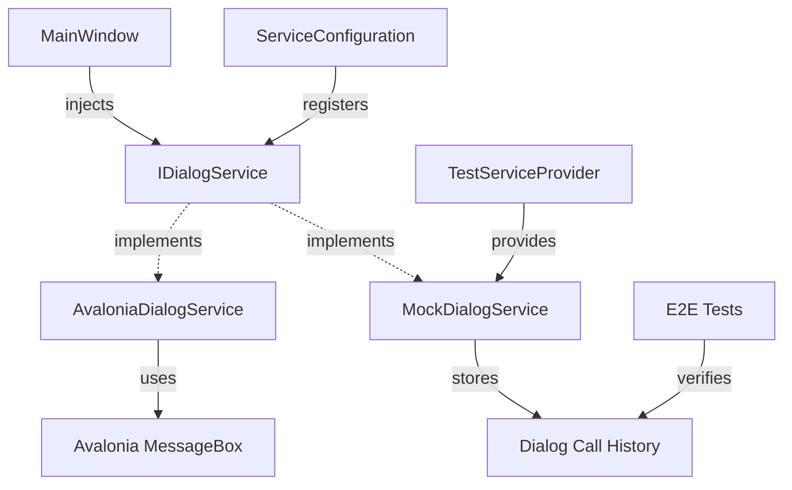

# Design Document

## Overview

This design addresses critical test infrastructure gaps in TeaLauncher by implementing a dialog service abstraction, comprehensive edge case coverage, and performance validation tests. The primary focus is fixing the 17 failing E2E tests by abstracting Avalonia MessageBox calls behind an IDialogService interface, enabling headless testing without display server dependencies.

The solution maintains TeaLauncher's clean architecture principles while adding testability to the presentation layer.

## Steering Document Alignment

### Technical Standards (tech.md)

The design follows established TeaLauncher patterns:
- **Clean Architecture**: Dialog service follows Domain → Application → Infrastructure → Presentation layer separation
- **Dependency Injection**: Services registered in ServiceConfiguration.cs with appropriate lifetimes
- **Interface-First Design**: IDialogService defines contracts, implementations handle platform specifics
- **Testing Framework**: NUnit + NSubstitute + FluentAssertions + Avalonia.Headless

### Project Structure (structure.md)

New components follow existing organization:
```
Domain/Interfaces/IDialogService.cs
Infrastructure/UI/AvaloniaDialogService.cs
Tests/Utilities/MockDialogService.cs
Tests/EndToEnd/ (existing, will be fixed)
Tests/Performance/ (new directory)
Tests/EdgeCases/ (new directory within existing structure)
```

## Code Reuse Analysis

### Existing Components to Leverage

- **ServiceConfiguration.cs**: Extend to register IDialogService with appropriate lifetime (Transient)
- **TestServiceProvider.cs**: Extend to provide MockDialogService in test scenarios
- **MockFactory.cs**: Add CreateMockDialogService() helper for test setup
- **TestBase.cs**: Potentially extend for performance test base class
- **Existing E2E tests**: Update to verify dialog interactions instead of failing

### Integration Points

- **MainWindow.axaml.cs**: Refactor to inject and use IDialogService instead of direct MessageBox calls
- **ApplicationOrchestrator.cs**: May need IDialogService for special command error reporting
- **YamlConfigLoaderService.cs**: Currently no dialog dependencies, remains unchanged
- **All E2E test classes**: Update to use MockDialogService for verification

## Architecture

### Modular Design Principles

- **Single File Responsibility**:
  - IDialogService.cs: Contract only
  - AvaloniaDialogService.cs: Production implementation only
  - MockDialogService.cs: Test implementation only
- **Component Isolation**: Dialog service has zero business logic, purely infrastructure
- **Service Layer Separation**: UI concerns (dialogs) separated from business logic
- **Utility Modularity**: Performance test utilities separated from E2E test utilities



## Components and Interfaces

### IDialogService (Domain/Interfaces)

- **Purpose:** Define contract for showing dialogs in UI
- **Interfaces:**
  - `Task ShowMessageAsync(string title, string message)`: Show information message
  - `Task<bool> ShowConfirmAsync(string title, string message)`: Show yes/no confirmation
  - `Task ShowErrorAsync(string title, string message)`: Show error message
- **Dependencies:** None (interface in Domain layer)
- **Reuses:** N/A (new interface)

### AvaloniaDialogService (Infrastructure/UI)

- **Purpose:** Production implementation using real Avalonia MessageBox
- **Interfaces:** Implements IDialogService
- **Dependencies:** Avalonia.Controls (MessageBox)
- **Reuses:** Avalonia framework MessageBox API
- **Implementation Notes:**
  - ShowMessageAsync: Wraps MessageBox.Show() with async wrapper
  - ShowConfirmAsync: Wraps custom confirmation dialog with Yes/No buttons
  - ShowErrorAsync: Uses MessageBox with error icon

### MockDialogService (Tests/Utilities)

- **Purpose:** Test implementation that records dialog calls for verification
- **Interfaces:** Implements IDialogService
- **Dependencies:** None
- **Reuses:** N/A (test utility)
- **Features:**
  - Records all dialog calls with timestamp, title, message
  - Allows pre-configuring return values for ShowConfirmAsync
  - Provides verification methods: `VerifyMessageShown(title, message)`, `GetDialogCalls()`
  - Supports asserting dialog order and count

### PerformanceTestBase (Tests/Performance)

- **Purpose:** Base class for performance tests with timing utilities
- **Interfaces:**
  - `TimeOperation(Action action): TimeSpan`: Measure synchronous operation
  - `TimeOperationAsync(Func<Task> action): Task<TimeSpan>`: Measure async operation
  - `AssertDuration(TimeSpan duration, int maxMs, string operationName)`: Assert performance
- **Dependencies:** NUnit, Stopwatch
- **Reuses:** TestBase.cs patterns (SetUp/TearDown)

### EdgeCaseTestFixtures (Tests/Utilities)

- **Purpose:** Provide edge case test data (unicode, special chars, large datasets)
- **Interfaces:**
  - `UnicodeCommandNames: List<string>`: Unicode command test data
  - `SpecialCharacterArguments: List<string>`: Special character test data
  - `LargeWordList: List<string>`: 1000+ word list for autocomplete stress testing
  - `MalformedYamlSamples: Dictionary<string, string>`: Various YAML syntax errors
- **Dependencies:** None
- **Reuses:** TestFixtures.cs patterns

## Data Models

### DialogCall (Test Utility Model)

```csharp
public record DialogCall(
    DateTime Timestamp,
    string DialogType,  // "Message", "Confirm", "Error"
    string Title,
    string Message,
    bool? UserResponse  // null for message/error, true/false for confirm
);
```

### PerformanceResult (Test Utility Model)

```csharp
public record PerformanceResult(
    string OperationName,
    TimeSpan Duration,
    int MaxAllowedMs,
    bool Passed
)
{
    public double DurationMs => Duration.TotalMilliseconds;
    public double PercentageOfLimit => (DurationMs / MaxAllowedMs) * 100;
}
```

## Error Handling

### Error Scenarios

1. **Dialog Service Not Registered**
   - **Handling:** ServiceConfiguration throws clear exception on startup if missing
   - **User Impact:** Developer sees immediate feedback, cannot run app without registration

2. **E2E Test Dialog Verification Failure**
   - **Handling:** FluentAssertions provides clear diff between expected and actual dialogs
   - **User Impact:** Developer sees exactly which dialog was shown vs expected

3. **Performance Test Timeout**
   - **Handling:** Test fails with clear message showing actual vs expected duration
   - **User Impact:** Developer knows exactly which operation is slow and by how much

4. **Edge Case Test Data Issues**
   - **Handling:** Test SetUp validates fixture data, fails fast if corrupted
   - **User Impact:** Clear error message about which fixture is broken

## Testing Strategy

### Unit Testing

**New Unit Tests:**
- **AvaloniaDialogServiceTests.cs**: Mock Avalonia MessageBox dependencies, verify calls
  - Test: `ShowMessageAsync_WithValidInput_CallsMessageBoxShow`
  - Test: `ShowConfirmAsync_WithUserYes_ReturnsTrue`
  - Test: `ShowErrorAsync_WithError_DisplaysErrorIcon`

- **MockDialogServiceTests.cs**: Verify mock behavior
  - Test: `RecordsDialogCalls_InOrder`
  - Test: `VerifyMessageShown_WithMatch_Succeeds`
  - Test: `GetDialogCalls_FiltersByType_ReturnsCorrect`

**Coverage Target:** 100% for both dialog service implementations

### Integration Testing

**Enhanced Integration Tests:**
- **MainWindowIntegrationTests.cs**: Test MainWindow with MockDialogService
  - Test: `ShowsErrorDialog_WhenCommandNotFound`
  - Test: `ShowsConfirmDialog_OnExit`
  - Test: `DialogsRecorded_ForVerification`

**Coverage Target:** All MainWindow dialog code paths covered

### End-to-End Testing

**Fixed E2E Tests (17 tests):**
- **ApplicationLifecycleTests.cs**:
  - Test: `CompleteLifecycle_StartInitializeExit_ShouldSucceed` (currently failing)
  - Fix: Use MockDialogService to capture dialogs instead of failing on render

- **UserWorkflowTests.cs**:
  - Test: `TypeCommand_PressEnter_ShouldExecuteCommand` (currently failing)
  - Test: `InvalidCommand_DoesNotExecute` (currently failing)
  - Test: `AutoCompletion_TabKey_CompletesCommand` (currently failing)
  - Fix: Inject MockDialogService, verify dialog calls instead of rendering

- **SpecialCommandsTests.cs**:
  - Test: `ReloadCommand_UpdatesConfig_ShouldWork` (currently failing)
  - Test: `VersionCommand_ShowsVersion_InDialog` (currently failing)
  - Test: `ExitCommand_ClosesApp` (currently failing)
  - Fix: Verify version/reload dialogs shown via MockDialogService

**New E2E Tests:**
- **ErrorHandlingWorkflowTests.cs**: Test error scenarios end-to-end
  - Test: `InvalidYaml_ShowsErrorDialog`
  - Test: `MissingCommand_ShowsNotFoundDialog`
  - Test: `HotkeyFailure_ShowsRegistrationError`

### Performance Testing

**New Performance Tests (Tests/Performance/):**
- **HotkeyPerformanceTests.cs**:
  - Test: `HotkeyActivation_ShowsWindow_Within100ms`
  - Uses: Stopwatch, headless window measurement

- **CommandExecutionPerformanceTests.cs**:
  - Test: `CommandExecution_FromInputToStart_Within100ms`
  - Test: `ConcurrentCommands_NoPerformanceDegradation`

- **AutoCompletePerformanceTests.cs**:
  - Test: `AutoComplete_With1000Words_Within50ms`
  - Test: `AutoComplete_WithUnicode_NoSlowdown`

- **ConfigLoadPerformanceTests.cs**:
  - Test: `ConfigLoad_100Commands_Within200ms`

**Performance Baselines:**
- Hotkey → Window: 100ms
- Command execution start: 100ms
- Autocomplete: 50ms
- Config load: 200ms

### Edge Case Testing

**New Edge Case Tests (integrated into existing test files):**

**CommandExecutorServiceTests.cs additions:**
- `ExecuteAsync_WithQuotedArguments_ParsesCorrectly`
- `ExecuteAsync_WithBackslashPaths_HandlesCorrectly`
- `ExecuteAsync_WithUnicodeInArguments_ExecutesCorrectly`
- `ExecuteAsync_ConcurrentCalls_MaintainsState`

**CommandRegistryServiceTests.cs additions:**
- `RegisterCommand_WithUnicodeNames_StoresCorrectly`
- `HasCommand_WithUnicodeLookup_FindsCorrectly`
- `GetAllCommands_EmptyRegistry_ReturnsEmpty`

**AutoCompleterServiceTests.cs additions:**
- `AutoComplete_LargeWordList_CompletesWithin50ms`
- `GetCandidates_UnicodeWords_ReturnsCorrectly`
- `AutoComplete_EmptyWordList_ReturnsEmptyString`

**YamlConfigLoaderServiceTests.cs additions:**
- `LoadConfiguration_MalformedYaml_ProvidesLineNumber`
- `LoadConfiguration_UnicodeCommands_LoadsCorrectly`
- `LoadConfigurationAsync_LargeFile_NoTimeout`

## Migration Path

### Phase 1: Dialog Service Infrastructure (Tasks 1-4)
1. Create IDialogService interface
2. Implement AvaloniaDialogService
3. Create MockDialogService
4. Register in DI containers

### Phase 2: MainWindow Refactoring (Tasks 5-7)
5. Refactor MainWindow to use IDialogService
6. Update ApplicationOrchestrator if needed
7. Run application smoke test

### Phase 3: E2E Test Fixes (Tasks 8-10)
8. Update TestServiceProvider to provide MockDialogService
9. Fix all 17 E2E tests
10. Verify all E2E tests pass

### Phase 4: Edge Cases & Performance (Tasks 11-14)
11. Add edge case test utilities and tests
12. Create performance test base class
13. Implement performance tests
14. Document test patterns in TESTING.md

### Rollback Plan
- If E2E tests still fail after dialog service: Keep MockDialogService, disable E2E tests temporarily
- If performance regression detected: Revert changes, profile bottleneck
- All changes are additive (no deletion), rollback is simple git revert

## Documentation Updates

### TESTING.md Updates
- Add section: "Testing Dialogs in E2E Tests"
- Add section: "Performance Testing Guidelines"
- Add section: "Edge Case Test Patterns"
- Update examples with dialog service usage
- Document MockDialogService API

### README.md Updates
- Update test count (212 → 229+ tests)
- Update coverage claims (mention E2E coverage)
- Note performance validation in features

### Code Comments
- XML documentation on IDialogService
- XML documentation on MockDialogService public API
- Performance test comments explaining timing expectations
- Edge case test comments explaining unusual scenarios
